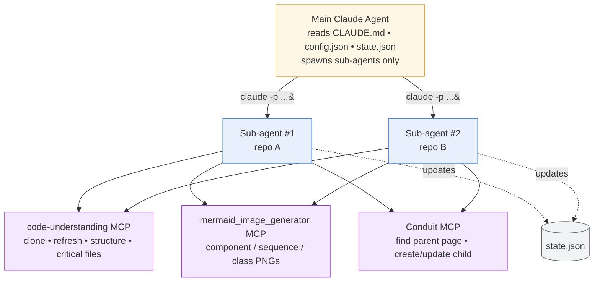
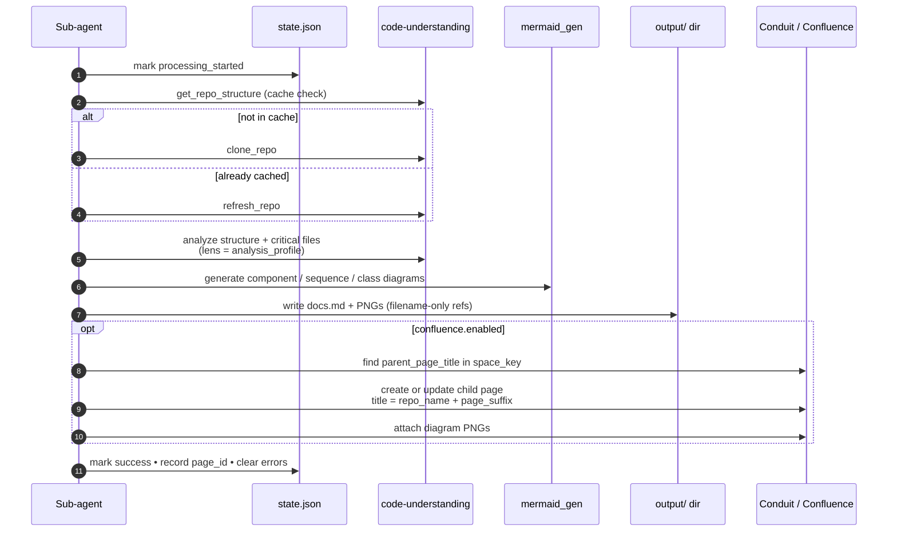

# GH Repo Code Intelligence — High-Level Walkthrough

A 3-page tour of what this tool does, how it's wired, and what happens when you run it.

---

## 1. What it does

You point it at one or more GitHub repos and pick an audience (developer, architect, ops, business, or generic). It clones each repo, analyzes the code, generates architectural diagrams, writes a stakeholder-tailored markdown document, and optionally publishes the result to Confluence.

There's no application code in this repo — the "engine" is `CLAUDE.md`, a long set of instructions that Claude Code follows when you run:

```bash
claude -p "Analyze repositories according to CLAUDE.md" --dangerously-skip-permissions
```

Everything else is config.

```mermaid
flowchart LR
    Cfg[config.json<br/>repos + analysis_profile]:::input
    CC[Claude Code<br/>follows CLAUDE.md]:::engine
    Local[output/{repo}/{timestamp}/<br/>docs.md + diagram PNGs]:::output
    Conf[Confluence child page<br/>under parent_page_title]:::output

    Cfg --> CC
    CC --> Local
    CC -->|if confluence.enabled| Conf

    classDef input fill:#e8f0fe,stroke:#4285f4
    classDef engine fill:#fff7e6,stroke:#f5a623
    classDef output fill:#e6f4ea,stroke:#34a853
```

---

## 2. How it's wired

The orchestration is deliberately split in two: a **main agent** that only plans and spawns work, and **sub-agents** that do the actual repo processing. The main agent never touches MCP tools directly — that constraint exists to avoid permission prompts breaking automation.

Sub-agents run in batches of up to 2 in parallel, each handling one repo end-to-end. They share progress via `state.json`. They talk to three MCP servers to do their job:



The main agent waits for each batch to finish before launching the next, so there's never more than 2 sub-agents running at once.

---

## 3. What happens per repo

Each sub-agent runs the same workflow against its assigned repo. The audience profile (`developer_onboarding`, `architecture_review`, etc.) shapes *what* gets emphasized in the analysis and the resulting docs — same workflow, different lens.



### How the audience choice flows through

The profile is the only thing that changes the output's character:

| `analysis_profile`        | Audience                | Page suffix convention            |
|---------------------------|-------------------------|-----------------------------------|
| `standard`                | Mixed technical         | *(none)*                          |
| `developer_onboarding`    | New devs                | ` - Developer Onboarding`         |
| `architecture_review`     | Architects, tech leads  | ` - Architecture Review`          |
| `business_understanding`  | PMs, business           | ` - Business Overview`            |
| `operations_handover`     | DevOps, SRE             | ` - Operations Handover`          |

Run the same repo under multiple profiles and you get separate Confluence pages side by side — `state.json`'s `profiles_analyzed` keeps track of each.

---

## TL;DR

- **Input:** `config.json` (repos + profile + Confluence target).
- **Engine:** Main Claude agent → spawns up to 2 sub-agents in parallel.
- **Tools:** `code-understanding` (analyze), `mermaid_image_generator` (diagrams), `Conduit` (publish).
- **Output:** Timestamped local folder with `docs.md` + PNGs, and (optional) a Confluence child page under your chosen parent.
- **Audience switch:** A single field — `analysis_options.analysis_profile` — drives what story the doc tells.
