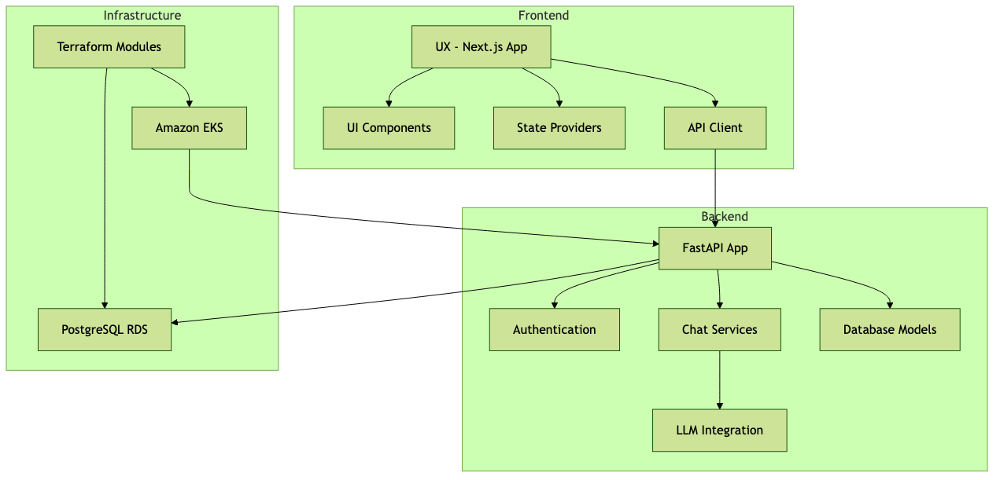
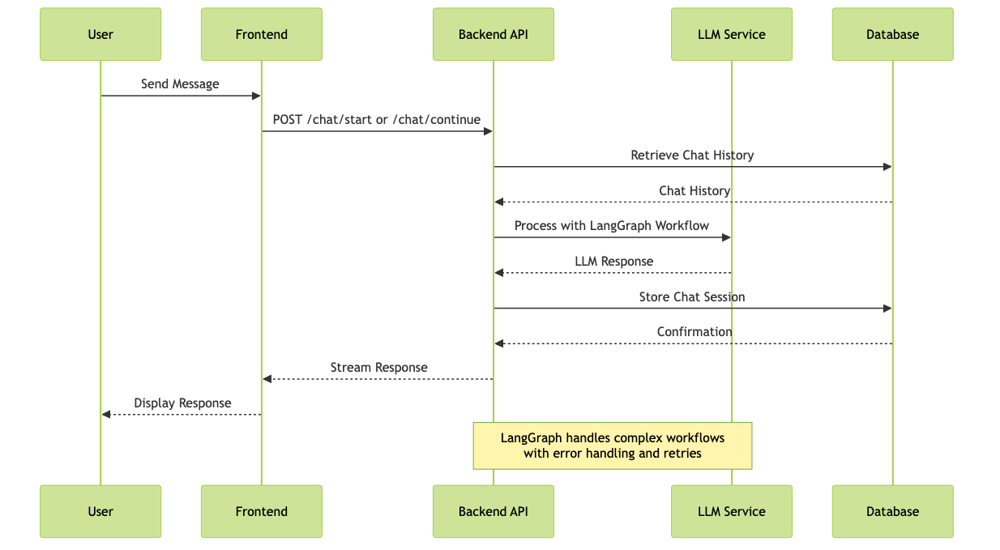

# SAGAAIDEV/saaga Repository Analysis

## Repository Overview

SAAGA is a comprehensive platform for building and interacting with AI-powered applications, featuring a FastAPI backend, Next.js frontend, and infrastructure managed with Terraform. The platform provides project management, source management, and chat functionality through a robust API.

## Architecture

The SAAGA platform consists of three main components:

1. **Frontend (UX)**: A Next.js application providing the user interface with React components and state management.
2. **Backend**: A FastAPI-based application that provides the API for project management, source management, and chat functionality.
3. **Infrastructure**: AWS-based infrastructure managed with Terraform, including EKS (Kubernetes) and RDS (PostgreSQL).

### Component Diagram

The following diagram illustrates the high-level architecture of the SAAGA platform:

### Chat Workflow Sequence

The following sequence diagram shows the chat workflow in SAAGA:

## Key Findings

### Backend Structure

The backend is organized into several key modules:

- **API Routes**: Located in `backend/src/app/api/` with endpoints for projects, sources, chat, and LLM configuration.
- **Core Services**: Located in `backend/src/app/core/` with authentication, chat functionality (using LangGraph), and configuration.
- **Database Models**: Located in `backend/src/app/model/` with schemas for projects, sources, and chat sessions.
- **Database Management**: Located in `backend/src/app/database/` with initialization and migration scripts.

### Frontend Structure

The frontend is a Next.js application with the following structure:

- **Components**: UI components for chat, projects, sources, and common elements like forms and navigation.
- **Providers**: Context providers for managing state (projects, sources, chats).
- **API Client**: Interfaces with the backend API for data fetching and mutation.
- **Pages**: Route handlers for the different application pages.

### Infrastructure

The infrastructure is managed with Terraform in the `stacks/` and `packages/` directories, with configurations for:

- Amazon EKS for Kubernetes deployment
- PostgreSQL RDS for database
- VPC and networking components
- CI/CD pipelines

## Important Files

### Backend

1. **`backend/src/app/core/chat/llm_error_handler.py`** - Critical file handling errors in LLM interactions with high complexity.
2. **`backend/src/app/api/chat.py`** - Implements chat API endpoints with session management and LLM integration.
3. **`backend/src/app/core/chat/llm_service.py`** - Core service for interacting with language models.
4. **`backend/src/app/api/source.py`** - API endpoints for managing sources in projects.
5. **`backend/src/app/api/project.py`** - API endpoints for project management.
6. **`backend/src/app/core/exceptions.py`** - Exception handling for the application.
7. **`backend/src/app/core/config.py`** - Configuration management for the application.
8. **`backend/src/app/database/init_db.py`** - Database initialization.

### Frontend (UX)

1. **`ux/src/components/ui/sidebar.tsx`** - Main navigation sidebar with high complexity.
2. **`ux/src/components/common/HierarchicalPicker.tsx`** - Component for hierarchical selection interfaces.
3. **`ux/src/providers/ProjectsProvider.tsx`** - State management for projects.
4. **`ux/src/providers/SourcesProvider.tsx`** - State management for sources.
5. **`ux/src/providers/ChatsProvider.tsx`** - State management for chat sessions.
6. **`ux/src/lib/api.ts`** - API client for communicating with the backend.
7. **`ux/src/lib/useChat.ts`** - Hook for managing chat functionality.

### Infrastructure

1. **`stacks/00.base`** - Base infrastructure Terraform configuration.
2. **`stacks/10.eks`** - EKS cluster Terraform configuration.
3. **`stacks/10.db`** - Database Terraform configuration.
4. **`stacks/20.k8s`** - Kubernetes resources Terraform configuration.
5. **`stacks/50.backend`** - Backend deployment Terraform configuration.

## Development Setup

### Backend

The backend can be set up using three methods:

1. **Docker Setup (Recommended)**: Using Docker Compose with minimal configuration.
2. **Dev Containers Setup (Experimental)**: Using VS Code Dev Containers.
3. **Local Development Setup**: Manual setup with Python 3.11, Poetry, and PostgreSQL.

### Frontend (UX)

The frontend requires:

1. Node.js and pnpm
2. Environment variables in `.env.local`
3. Database migrations via `pnpm generate` and `pnpm migrate`

## Conclusion

SAAGA is a comprehensive platform for AI-powered applications with a robust architecture featuring a FastAPI backend, Next.js frontend, and AWS infrastructure. The platform provides project management, source management, and chat functionality through a well-structured API.

The codebase is well-organized, with clear separation of concerns and extensive documentation. The use of modern technologies like FastAPI, Next.js, and LangGraph showcases a forward-thinking approach to building AI applications.