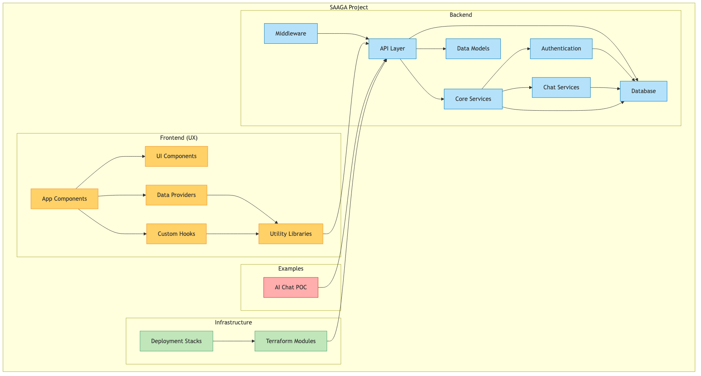
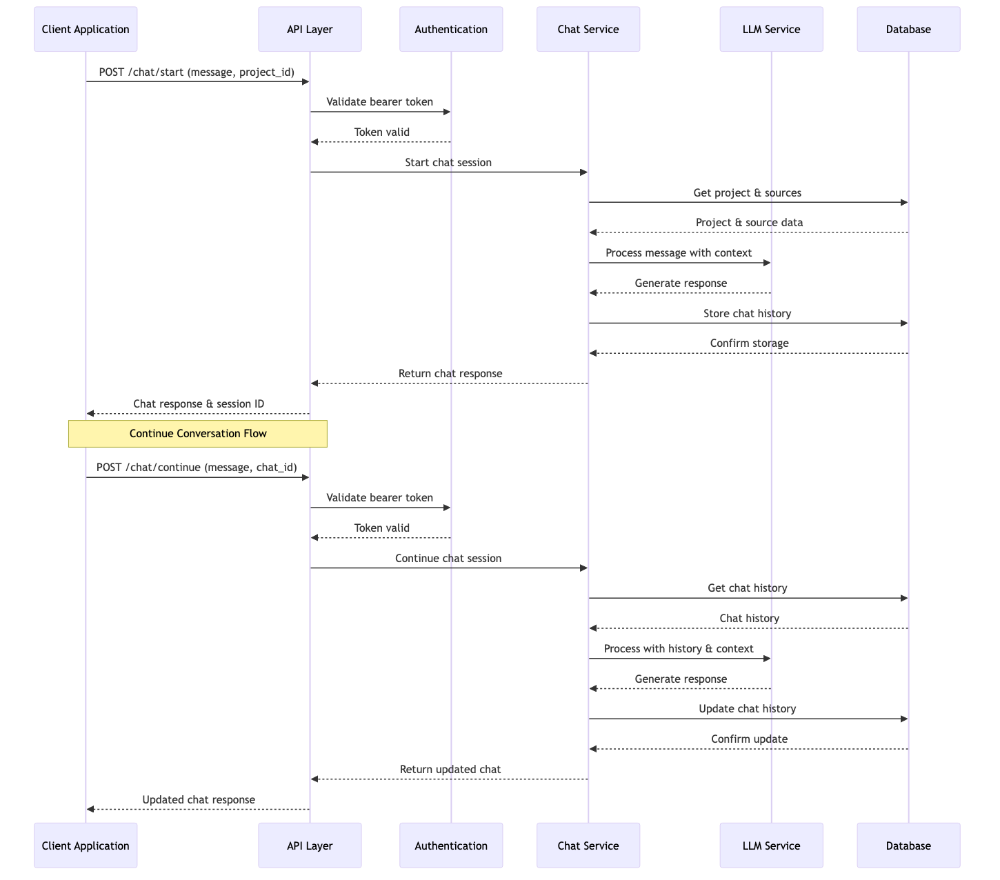

# SAGAAIDEV/saaga Repository Analysis

## Repository Overview

SAAGA is a comprehensive platform that provides AI-powered chat functionality with project and source management capabilities. The repository is organized into several main components:

1. **Backend**: A FastAPI-based application that provides the core API services
2. **Frontend (UX)**: A web-based user interface built with modern web technologies
3. **Infrastructure**: Terraform modules and deployment stacks for AWS infrastructure
4. **Examples**: Example implementations and POCs using the SAAGA platform

## Architecture

The SAAGA platform follows a modern, modular architecture with clear separation of concerns. The system is designed to be deployable on AWS infrastructure using Terraform for infrastructure as code.

### Component Diagram

The following diagram shows the high-level components of the SAAGA platform and their relationships:



### Interaction Flow

The sequence diagram below illustrates the typical flow of a chat interaction in the SAAGA platform:



## Key Components

### Backend

The backend is built with FastAPI and provides a robust API for project management, source management, and chat functionality. Key features include:

- **API Layer**: FastAPI routes and endpoint handlers
- **Core Services**: Central business logic and functionality
- **Authentication**: Secure API access with bearer token authentication
- **Chat Services**: Integrated LangGraph for persistent chat workflows
- **Database**: PostgreSQL for data persistence
- **Middleware**: Request/response processing middlewares
- **Models**: Database models and schemas

The backend follows a clean architecture with separation of concerns:

```
backend/
├── src/
│   └── app/
│       ├── api/              # API routes and endpoint handlers
│       ├── core/             # Core functionality, auth, and shared utilities
│       │   ├── auth/         # Authentication and authorization
│       │   └── chat/         # Chat functionality using LangGraph
│       ├── database/         # Database configuration and initialization
│       ├── middleware/       # Request/response middleware
│       └── model/            # Database models and schemas
├── tests/
│   ├── integration/          # Integration tests
│   ├── unit/                 # Unit tests
│   └── conftest.py           # Shared test fixtures and utilities
├── docs/                     # Documentation
└── scripts/                  # Utility scripts
```

### Frontend (UX)

The frontend is a web application built with modern web technologies:

- **App Components**: Main application pages and routes
- **UI Components**: Reusable UI elements and design system components
- **Custom Hooks**: React hooks for state management and business logic
- **Data Providers**: Context providers for data management
- **Utility Libraries**: Helper functions and utilities

### Infrastructure

The infrastructure is managed using Terraform and is organized into modular components:

- **Terraform Modules**: Reusable infrastructure components
- **Deployment Stacks**: Environment-specific deployments

## Critical Files

Based on the code analysis, these are some of the most significant files in the repository:

1. **backend/src/app/core/chat/llm_error_handler.py**: Handles error conditions in LLM interactions
2. **backend/src/app/api/chat.py**: Implements the chat API endpoints
3. **backend/src/app/core/chat/llm_service.py**: Service for interacting with language models
4. **backend/src/app/api/source.py**: API for managing sources
5. **backend/src/app/api/project.py**: Project management API endpoints
6. **ux/src/components/ui/sidebar.tsx**: UI navigation component
7. **ux/src/providers/ProjectsProvider.tsx**: Data provider for projects
8. **ux/src/providers/SourcesProvider.tsx**: Data provider for sources
9. **ux/src/providers/ChatsProvider.tsx**: Data provider for chat functionality

## Development Environment

The project supports multiple development environment setups:

1. **Docker Setup (Recommended)**: Uses Docker and Docker Compose for a consistent environment
2. **Dev Containers Setup**: Experimental setup using VS Code Dev Containers
3. **Local Development**: Direct setup on the developer's machine

## API Documentation

The API documentation is available in multiple formats when the application is running:

1. **Swagger UI**: Interactive documentation at `/api/docs`
2. **ReDoc**: Clean reference documentation at `/api/redoc`
3. **OpenAPI JSON**: Machine-readable spec at `/api/openapi.json`

## Conclusions

SAAGA is a well-structured, modern application with a clear separation of concerns and a focus on maintainability. The codebase follows industry best practices with comprehensive testing and documentation.

Key architectural highlights:

1. **Modular Design**: Clear separation between components
2. **API-First Approach**: Well-defined API interfaces
3. **Infrastructure as Code**: AWS infrastructure managed via Terraform
4. **Developer Experience**: Multiple development environment options
5. **Testing Strategy**: Both unit and integration tests

Future development should continue to maintain these architectural principles while expanding the functionality of the platform.