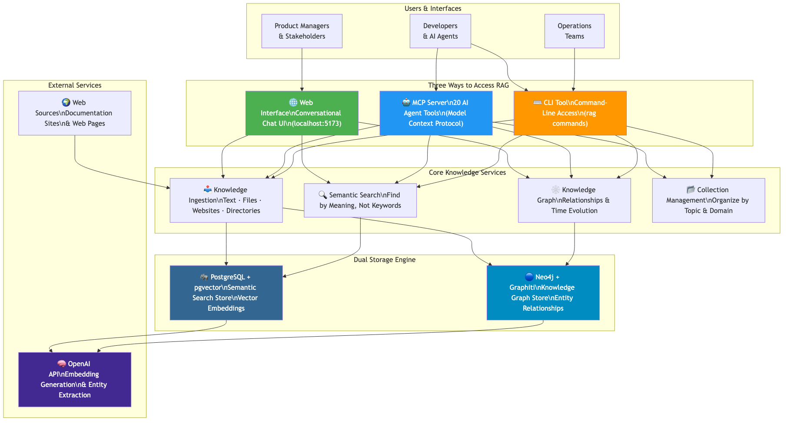
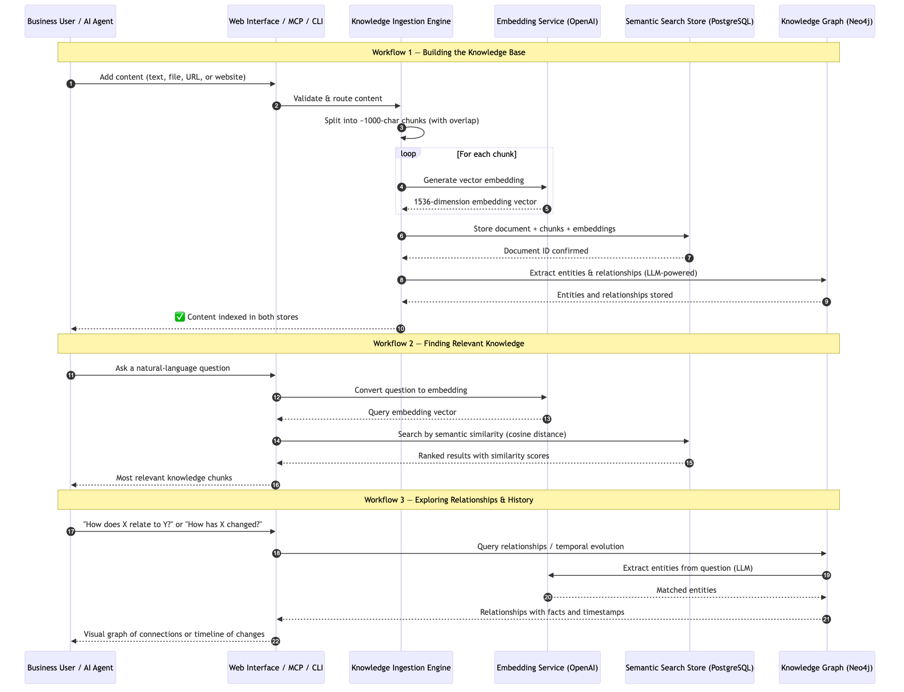
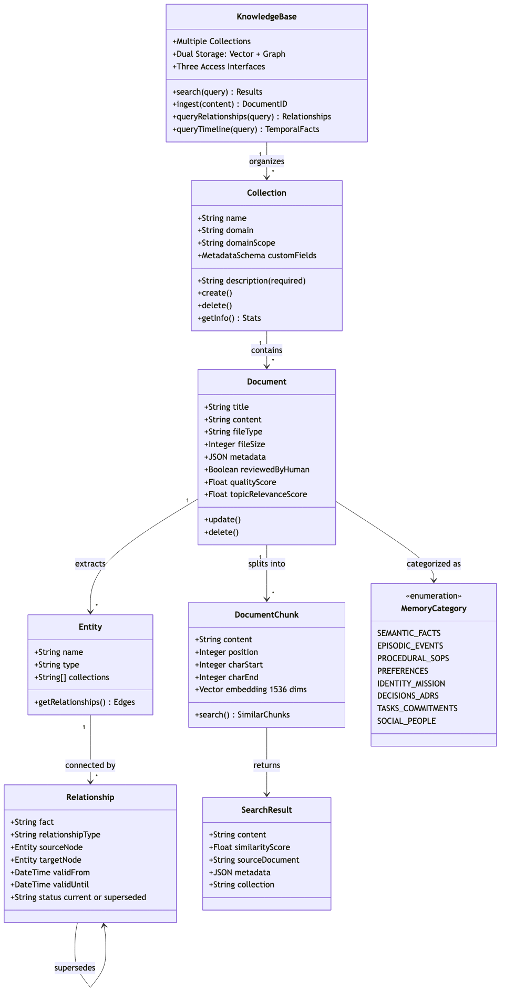

# RAG Memory — Business Understanding Guide

**Repository:** codingthefuturewithai/rag-memory  
**Analysis Date:** 2026-04-29  
**Profile:** Business Understanding — for Product Managers, Executives, and Business Stakeholders  
**Source:** https://github.com/codingthefuturewithai/rag-memory

---

## Table of Contents

1. [What Is RAG Memory?](#what-is-rag-memory)
2. [The Business Problem It Solves](#the-business-problem-it-solves)
3. [Key Business Capabilities](#key-business-capabilities)
4. [How Users Interact With the System](#how-users-interact-with-the-system)
5. [Core User Journeys](#core-user-journeys)
6. [Knowledge Domain Concepts](#knowledge-domain-concepts)
7. [Memory Categories — What You Can Store](#memory-categories--what-you-can-store)
8. [System Components Overview](#system-components-overview)
9. [Cost Model](#cost-model)
10. [Business Rules & Constraints](#business-rules--constraints)
11. [What the System Does Not Do](#what-the-system-does-not-do)
12. [Deployment & Availability](#deployment--availability)
13. [Integration Points](#integration-points)
14. [Future Capabilities on the Roadmap](#future-capabilities-on-the-roadmap)
15. [Summary for Decision Makers](#summary-for-decision-makers)

---

## What Is RAG Memory?

RAG Memory is a **production-ready knowledge management platform** that gives AI assistants and teams a long-term, searchable memory. Think of it as a smart library that:

- **Understands meaning**, not just keywords — ask it "How do I configure authentication?" and it finds everything relevant, even if the documents never use those exact words
- **Maps relationships between concepts** — knows that "Stripe" connects to "billing" connects to "refund policy"
- **Tracks how knowledge evolves over time** — can tell you when a fact changed and what superseded it

The name "RAG" stands for **Retrieval-Augmented Generation** — a pattern where AI models search a knowledge base for relevant context before answering a question. RAG Memory provides the retrieval layer of that pattern.

### The One-Sentence Summary

> RAG Memory is a searchable, AI-friendly knowledge base that understands language, maps entity relationships, and tracks how knowledge changes over time — accessible to humans via a web interface, to AI agents via a standard protocol, and to automation via a command-line tool.

---

## The Business Problem It Solves

### Problem 1 — AI Assistants Have No Long-Term Memory

AI tools like Claude, ChatGPT, and Cursor forget everything when a session ends. Every conversation starts from scratch. Teams must repeatedly paste the same documentation, policies, and context into every chat. RAG Memory gives AI assistants a persistent memory they can query at any time.

### Problem 2 — Knowledge Is Scattered and Hard to Search

Documentation lives in wikis, PDFs, websites, emails, and meeting notes. Traditional search requires exact keyword matches. RAG Memory ingests all of this content and makes it semantically searchable — meaning you find what you need based on what you *mean*, not what you *typed*.

### Problem 3 — Relationships Between Concepts Are Invisible

It's hard to discover that a compliance policy connects to a specific configuration file which connects to a known customer-facing bug. RAG Memory's knowledge graph surfaces these connections automatically as content is ingested.

### Problem 4 — No Institutional Memory for Decisions

When an engineer leaves or a team restructures, the reasoning behind past decisions is lost. RAG Memory stores Architecture Decision Records (ADRs), meeting notes, and rationale documents, and makes them queryable — including "Was this decision superseded? When? By what?"

---

## Key Business Capabilities

| Capability | What It Means for the Business |
|---|---|
| **Semantic Search** | Find relevant knowledge using natural-language questions, not keyword guessing |
| **Knowledge Graph** | Discover hidden connections between people, systems, policies, and decisions |
| **Temporal Tracking** | See how facts and decisions evolved over time — what changed, when, and why |
| **Web Crawling** | Automatically ingest entire documentation websites, keeping content up to date |
| **AI Agent Memory** | Give AI tools (Claude, Cursor, ChatGPT) persistent, searchable institutional knowledge |
| **Multi-Instance Support** | Run separate isolated knowledge bases for different teams, projects, or clients |
| **Quality Scoring** | Every piece of ingested content receives an automatic quality score; human-reviewed content is flagged separately |
| **Collection Management** | Organize knowledge by domain (policies, procedures, decisions, people) for targeted retrieval |
| **Document Lifecycle** | Full create-read-update-delete for all stored knowledge |

---

## How Users Interact With the System

RAG Memory offers three distinct access modes, each designed for a different audience:



### 1. Web Interface — For Human Users

A conversational chat application accessible at `http://localhost:5173`. Users type natural-language questions and the system responds using an AI agent that dynamically selects from 20 knowledge tools.

**Best for:** Interactive knowledge exploration, adding new content via chat, visual knowledge graph exploration, and conversational document discovery.

**Key interface features:**
- **Chat panel** — Conversational Q&A with the AI assistant
- **Collections sidebar** — Browse and switch between knowledge domains
- **Document viewer** — Inspect and read full source documents
- **Knowledge graph visualization** — See entity connections visually
- **Web search integration** — Discover and evaluate external content before ingesting it
- **Streaming responses** — See answers appear word-by-word in real time
- **Conversation history** — All chats are persisted and can be revisited

### 2. MCP Server — For AI Agents

A standardized protocol server (Model Context Protocol, developed by Anthropic) that exposes 20 tools to AI coding assistants and automation agents.

**Best for:** Connecting Claude Desktop, Claude Code, Cursor, or any MCP-compatible AI tool to the knowledge base. The AI agent can autonomously search, ingest, and manage knowledge without human step-by-step guidance.

**Supported AI tools:** Claude Desktop, Claude Code (the Anthropic CLI), Cursor IDE, and any tool supporting the MCP standard.

### 3. CLI Tool — For Operations & Automation

A command-line interface (`rag` command) for scripting, bulk operations, and system management.

**Best for:** Automated ingestion pipelines, backup/restore, system health checks, and DevOps workflows.

---

## Core User Journeys

The following diagram shows how users interact with RAG Memory across its three core workflows:



### Journey 1 — Building the Knowledge Base ("Ingesting Content")

**Who does this:** Any team member, AI agent, or automated pipeline that has content to add.

**Step-by-step:**
1. User provides content — this can be pasted text, a file, a URL, or an entire website
2. The system automatically splits the content into ~1,000-character searchable chunks (with 200-character overlap to preserve context across boundaries)
3. Each chunk is converted into a mathematical vector (embedding) that captures its meaning
4. Both the original document and all chunks are stored in the database
5. Simultaneously, the system uses AI to extract named entities and relationships (e.g., "Stripe PROCESSES payments for billing module")
6. The system reports back: document ID, number of chunks created, and entities extracted

**Time to complete:** Seconds for text/files; minutes for large websites with many pages.

**Cost:** A one-time embedding cost applies per ingestion (~$0.02 per million tokens with OpenAI's smallest model — negligible for typical use).

---

### Journey 2 — Finding Relevant Knowledge ("Semantic Search")

**Who does this:** Any user needing to retrieve information.

**Step-by-step:**
1. User asks a natural-language question: *"What is our policy on customer refunds?"*
2. The system converts the question into the same kind of mathematical vector used during ingestion
3. The database finds all chunks whose vectors are "close in meaning" to the question
4. Results are ranked by similarity score (0.0–1.0 scale) and returned with source document information
5. Users can optionally filter results by collection, quality score, or human-review status

**Key rule:** Use complete questions, not keyword fragments. *"authentication configuration"* will return poor results; *"How do I configure authentication for new users?"* will find exactly what's needed.

**Default behavior:** Results must score 0.35 or higher similarity (configurable). Returns the 5 most relevant chunks by default (configurable up to 50).

---

### Journey 3 — Exploring Relationships ("Knowledge Graph Query")

**Who does this:** Users seeking to understand connections between concepts, or to trace how decisions and policies are interrelated.

**Step-by-step:**
1. User asks a relationship question: *"How does our authentication system relate to the compliance policy?"*
2. The system uses AI to extract entities from the question (e.g., "authentication system", "compliance policy")
3. The knowledge graph is queried for all known connections involving those entities
4. Relationships are ranked by relevance and returned with the underlying facts (e.g., *"Authentication system MUST comply with SOC2 policy per ADR-014"*)
5. Results include temporal metadata: when each fact became true and whether it has since been superseded

---

### Journey 4 — Tracking Knowledge Evolution ("Temporal Query")

**Who does this:** Anyone needing an audit trail or historical perspective.

**Example questions:**
- *"How has our deployment process changed since 2025?"*
- *"What API decisions were made in Q4 that were later reversed?"*
- *"Show me the history of how we've handled on-call escalation."*

The system returns a timeline showing each fact, when it was established (`valid_from`), when it was superseded (`valid_until`), and whether it is still current or has been replaced.

---

## Knowledge Domain Concepts

Understanding these four core building blocks makes the system intuitive to use:

### Collections — Organizational Containers

A Collection is a named, purpose-specific container for related documents. Every document belongs to at least one collection.

**Rules:**
- Every collection **must** have a description (enforced by the database — descriptions without meaningful text are rejected)
- Documents can belong to **multiple** collections (many-to-many relationship)
- Searches can be scoped to a single collection or run across all collections
- Recommended pattern: one collection per knowledge domain (e.g., `company-policies`, `meeting-notes`, `architecture-decisions`)

**Example collection structure for a typical organization:**
```
company-policies/      → HR, security, compliance, refund rules
system-architecture/   → Technical design decisions
meeting-notes/         → Decisions and outcomes from meetings
deployment-runbooks/   → Step-by-step operational procedures
stakeholders/          → People profiles and relationship context
company-strategy/      → Mission, vision, OKRs
architecture-decisions/ → ADRs with rationale and tradeoffs
```

### Documents — The Units of Knowledge

A Document is the full, original piece of content ingested into the system — a policy PDF, a webpage, a meeting summary, or a block of pasted text.

**What gets stored:**
- The complete original content (always preserved for full-context retrieval)
- Automatically generated searchable chunks
- Flexible metadata (any JSON fields the user defines)
- Quality score (automatically computed)
- Human-review flag (manually set to indicate verified, trusted content)

### Chunks — What Gets Searched

Chunks are the searchable pieces the system creates automatically from each document. Users never manage chunks directly — they're an internal mechanism. Each chunk is ~1,000 characters with 200-character overlap to ensure no context is lost at boundaries.

### Entities & Relationships — The Knowledge Graph Layer

As content is ingested, the system uses AI to identify named entities (people, systems, policies, concepts) and the relationships between them. These are stored in a separate graph database (Neo4j) and power the relationship-query and temporal-query capabilities.

---

## Memory Categories — What You Can Store

RAG Memory is designed to hold **eight distinct types of organizational knowledge**. The system treats all of these uniformly — they're all just documents and collections — but each has recommended patterns for maximum effectiveness:



### 1. Semantic Memory — Facts & Organizational Knowledge
*Stable facts that don't change frequently*

Examples: "Our billing system uses Stripe." | "The API rate limit is 1,000 requests/minute." | "Refund policy: 14 days."

**Retrieval strength:** Excellent — this is the core use case for vector search.

### 2. Episodic Memory — Events & What Happened
*Time-bounded experiences, decisions, meetings, incidents*

Examples: "On 2025-11-12 we decided to deprecate Feature A." | "Customer outage on 2025-10-15 caused by DNS issue."

**Retrieval strength:** Excellent — temporal graph tracks current vs. superseded facts.

### 3. Procedural Memory — SOPs & How-To Guides
*Step-by-step processes, runbooks, checklists*

Examples: "How to deploy to production." | "Customer escalation process." | "Database backup procedure."

**Retrieval strength:** Good — semantic search finds procedures; full document retrieval brings back the complete steps.

### 4. Preference Memory — Organizational Principles
*Stable preferences, constraints, and guiding principles*

Examples: "Prefer PostgreSQL over MongoDB for transactional data." | "Always use TypeScript." | "Tim prefers async communication."

**Retrieval strength:** Good — useful for AI agents consulting preferences before making recommendations.

### 5. Identity/Mission Memory — Strategic Direction
*Mission, vision, goals, north-star metrics*

Examples: "Mission: Empower engineers to build AI-native applications." | "Success metric: Course completion + retention."

**Retrieval strength:** Good — helps AI agents align decisions with organizational strategy.

### 6. Decision Memory — Rationale & ADRs
*Why decisions were made, alternatives considered*

Examples: "Chose pgvector over Pinecone for simplicity and lower cost." | "ADR-003: Use REST over GraphQL for public API."

**Retrieval strength:** Excellent — temporal graph shows if decisions were later superseded.

### 7. Task/Commitment Memory — Open Loops
*Actionable commitments and time-sensitive reminders*

Examples: "Follow up with vendor next Tuesday." | "Renew SSL certificate before 2026-02-01."

**Retrieval strength:** Limited — RAG Memory is a knowledge base, not a task manager. Best used for storing context *about* tasks, not for managing due dates and notifications.

### 8. Social/Relationship Memory — People Context
*People profiles, relationships, prior interactions*

Examples: "Alice prefers async updates." | "Carol is the decision-maker for Project X."

**Retrieval strength:** Good — supports pre-meeting context retrieval and relationship graph queries.

---

## System Components Overview

The following diagram illustrates how the major components of RAG Memory work together:

### Component Breakdown

| Component | Role | Technology |
|---|---|---|
| **Web Frontend** | Conversational chat UI | React 19, Mantine UI, Vite |
| **Web Backend** | API server & AI orchestration | FastAPI, LangGraph ReAct Agent |
| **MCP Server** | 20-tool AI agent interface | FastMCP (Anthropic standard) |
| **CLI Tool** | Command-line management | Click, Python |
| **Vector Store** | Semantic search engine | PostgreSQL 17 + pgvector |
| **Graph Store** | Relationship & temporal queries | Neo4j + Graphiti |
| **Embedding Engine** | Convert text to meaning-vectors | OpenAI text-embedding-3-small |
| **Web Crawler** | Ingest websites automatically | Crawl4AI (Playwright-based) |

### The Dual Storage Model — Why Two Databases?

RAG Memory uses two complementary databases working in tandem:

**PostgreSQL + pgvector (the "what" database)**
- Stores the actual document content and its searchable chunks
- Answers questions like: *"What does the documentation say about authentication?"*
- Returns text passages ranked by semantic similarity

**Neo4j + Graphiti (the "how" and "when" database)**
- Stores entities and relationships extracted from documents
- Answers questions like: *"How does authentication relate to the compliance framework?"* and *"When did this relationship change?"*
- Returns facts, connections, and historical timelines

Both databases are updated simultaneously when content is ingested — users interact with both through the same interface without needing to know which database answers which question.

---

## Cost Model

RAG Memory is designed to be extremely cost-effective:

### Infrastructure Costs

| Component | Hosting Option | Approximate Cost |
|---|---|---|
| PostgreSQL | Local Docker (free) or cloud managed | $0–$50/month |
| Neo4j | Local Docker (free) or Neo4j Aura (cloud) | $0–$65/month |
| RAG Memory server | Local or any cloud VM | $0–$20/month |

### AI API Costs (OpenAI)

| Operation | Cost | Example |
|---|---|---|
| **Ingestion (one-time)** | $0.02 per million tokens | 10,000 docs × 750 tokens avg = **$0.15 total** |
| **Search (per query)** | ~$0.00003 per query | Negligible at any scale |
| **Graph entity extraction** | ~$0.01–$0.05 per document | Depends on document length |

### Summary

For a typical team with 10,000 documents ingested once, the total AI API cost is approximately **$0.15–$5.00**. Ongoing query costs are negligible. Infrastructure costs depend on whether self-hosted or cloud-hosted.

---

## Business Rules & Constraints

These rules govern how the system behaves and should inform content strategy:

### Ingestion Rules

| Rule | Detail |
|---|---|
| **Collection description is required** | Every collection must have a meaningful description — the database enforces this with a NOT NULL constraint and minimum length check |
| **Semantic search only** | The system uses vector similarity — keyword searches will not work as expected |
| **Duplicate prevention** | Re-ingesting a URL or file that already exists raises an error unless `mode="reingest"` is specified (which replaces the existing content) |
| **Web crawl limit** | Web crawls respect a configurable maximum page count to prevent runaway ingestion |
| **Concurrent deduplication** | The system blocks duplicate concurrent requests — only one ingestion of the same URL can run at a time |

### Search Rules

| Rule | Detail |
|---|---|
| **Minimum similarity threshold** | By default, results scoring below 0.35 similarity are excluded. This can be lowered for exploratory searches or raised for high-precision retrieval |
| **Natural language queries** | Questions must be natural language sentences, not keyword lists |
| **Result limit** | Default 5 results per search, configurable up to 50 |
| **Collection scoping** | Searches can be scoped to one collection or span all collections |

### Data Quality Rules

| Rule | Detail |
|---|---|
| **Automatic quality scoring** | Every ingested document receives a quality score (0.0–1.0). Low-quality content can be filtered out during retrieval |
| **Human review flag** | Documents verified by a human can be flagged `reviewed_by_human=true` — retrieval can be restricted to human-reviewed content only |
| **Topic relevance scoring** | When content is ingested with a declared topic, the system scores how relevant it is to that topic — enabling precision filtering |

### Data Architecture Rules

| Rule | Detail |
|---|---|
| **Many-to-many documents/collections** | One document can belong to multiple collections without duplication |
| **Cascading deletion** | Deleting a collection deletes all its document-collection links; deleting a document removes it from all collections |
| **Full document always preserved** | The original complete document is always stored, regardless of chunking — full retrieval is always possible |
| **Temporal immutability** | The graph stores facts with timestamps; superseded facts are marked but not deleted, preserving the audit trail |

---

## What the System Does Not Do

Understanding limitations is as important as understanding capabilities:

| Limitation | Implication |
|---|---|
| **No keyword search** | Cannot do traditional "find the exact phrase" style searches; semantic search requires natural-language questions |
| **No date-range filtering** | Cannot query "show me documents added between Jan 1 and Mar 31" — dates must be in content or metadata and filtered externally |
| **No reminder/notification system** | Not a task manager — it stores task context but cannot notify when deadlines approach |
| **No contradiction detection** | If two documents contradict each other, the system stores both without flagging the conflict |
| **No automatic deduplication** | Semantically similar content from different sources will both be stored — manual review before ingesting is recommended |
| **No calendar or CRM integration** | People notes and event dates must be ingested manually |
| **No real-time data** | Content is static after ingestion — live database queries or streaming data sources are not supported |
| **Not a structured database** | Designed for unstructured text, not for querying tabular data or running analytics |
| **Not a chatbot** | The web interface uses an AI agent, but RAG Memory itself is purely a retrieval layer — responses depend on the LLM integrated at the chat layer |

---

## Deployment & Availability

### Running Locally

The system runs entirely on a developer's laptop or server using Docker:

```
Start all services (first time):
  python manage.py setup   → install deps + run migrations

Start for daily use:
  python manage.py start   → starts all services

Access:
  Web interface: http://localhost:5173
  MCP server:    http://localhost:3001
  API backend:   http://localhost:8000
```

### Cloud Deployment

RAG Memory supports deployment to cloud platforms:

- **PostgreSQL (vector store):** Any managed PostgreSQL with pgvector support (Supabase, Neon, Railway, AWS RDS)
- **Neo4j (graph store):** Neo4j Aura (managed cloud Neo4j)
- **Application:** Any cloud VM or container platform (Render, Railway, Fly.io, AWS)

### Multi-Instance Support

Organizations can run **multiple completely isolated knowledge bases** — for example:
- One instance for the engineering team
- One instance for the product team
- One instance per client project

Each instance gets its own PostgreSQL database, Neo4j graph, and MCP server on different ports. Instances are managed with `rag instance` commands.

**Automatic port allocation:**
| Instance | PostgreSQL | Neo4j | MCP Server |
|---|---|---|---|
| Instance 1 (primary) | 54320 | 7687/7474 | 8000 |
| Instance 2 | 54330 | 7688/7475 | 8001 |
| Instance 3 | 54340 | 7689/7476 | 8002 |

---

## Integration Points

### AI Agent Integrations

RAG Memory integrates with any AI tool that supports MCP (Model Context Protocol):

| Tool | Integration Method |
|---|---|
| Claude Desktop | Add MCP server config to `claude_desktop_config.json` |
| Claude Code (CLI) | `claude mcp add rag-memory --type sse --url http://localhost:8000/sse` |
| Cursor IDE | Add MCP server via Cursor settings |
| Custom Agents | Connect via HTTP SSE endpoint or stdio transport |

### The 20 MCP Tools Available to AI Agents

Once connected, AI agents can autonomously use all 20 tools without human prompting:

**Knowledge Retrieval (3 tools):**
- Search documents by semantic similarity
- Query knowledge graph relationships
- Query temporal evolution of knowledge

**Content Ingestion (5 tools):**
- Ingest text content directly
- Ingest from a file path
- Ingest an entire directory of files
- Crawl and ingest a URL (with optional link-following)
- Analyze a website's structure before crawling

**Collection Management (6 tools):**
- Create, list, update, delete collections
- Get collection statistics and crawl history
- Manage document-collection links

**Document Management (5 tools):**
- List documents (with pagination)
- Retrieve a full document by ID
- Update document content (triggers automatic re-indexing)
- Delete documents
- Browse directory contents

---

## Future Capabilities on the Roadmap

The following capabilities are documented in the project's `future-work/` directory as planned enhancements:

### Agent-Side Memory Routing
A planned capability where AI agents automatically classify and route incoming information to the correct collection based on content type — without users specifying where to store information.

### Long-Term Memory Categories for Agents
A structured framework defining nine universal collections for individual or organizational use, making it easy for agents to maintain consistent, well-organized memory across all interactions.

### Source-Aware Chunking
Enhanced document splitting that understands document structure (headings, code blocks, lists) to create semantically coherent chunks, rather than splitting purely by character count.

### Two-Phase Commit for Ingestion Atomicity
Currently, if entity extraction into Neo4j fails after PostgreSQL has already been written, the two stores can become inconsistent. A two-phase commit pattern is planned to ensure both succeed or both fail together.

### Date-Range Query Support
Enabling queries like "show me everything ingested between January and March" — currently not possible with standard metadata filtering.

### Contradiction Detection
Automatic flagging when newly ingested content contradicts existing facts in the knowledge base.

---

## Summary for Decision Makers

### What RAG Memory Delivers

RAG Memory is a **self-hosted, production-grade knowledge platform** that transforms static documents and scattered institutional knowledge into a living, queryable memory that AI systems and human teams can access through natural language.

**In business terms:**
- **Reduces repeated context-setting** — AI tools no longer need to be briefed from scratch every session
- **Preserves institutional knowledge** — departing employees' knowledge can be captured before they leave
- **Accelerates information discovery** — teams find what they need in seconds, not hours
- **Provides an audit trail** — every fact carries a creation timestamp; superseded facts are kept, not deleted
- **Scales to multi-team use** — isolated instances for different teams, projects, or clients

### Who Benefits

| Stakeholder | Primary Benefit |
|---|---|
| **Product Managers** | Query policies, competitive research, and product specs in natural language; track how product decisions evolved |
| **Engineering Teams** | Searchable architecture decisions, runbooks, and technical context; persistent AI coding assistant memory |
| **Operations/DevOps** | Searchable runbooks and procedures; automated ingestion from documentation sites |
| **Executives** | Query company strategy, OKRs, and decision rationale; understand how business context has evolved |
| **Customer-Facing Teams** | Instant access to accurate policy information for customer queries |

### The Core Value Proposition

> RAG Memory gives both humans and AI tools a shared, persistent, semantically searchable memory of everything your organization knows — at a cost of essentially zero per query.

---

*Documentation generated on 2026-04-29 using the business_understanding analysis profile.*  
*Source repository: https://github.com/codingthefuturewithai/rag-memory*
