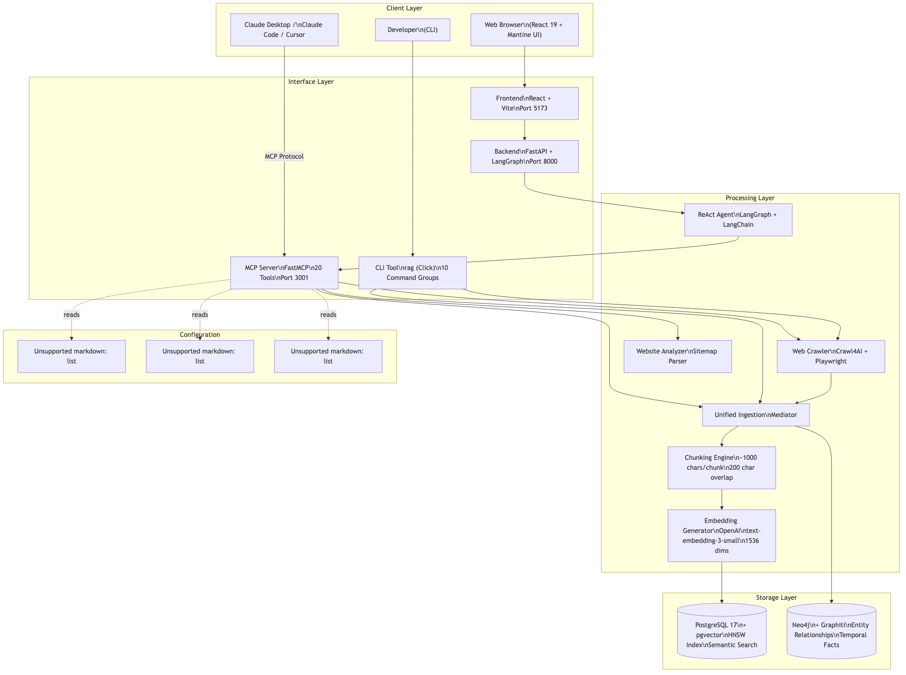
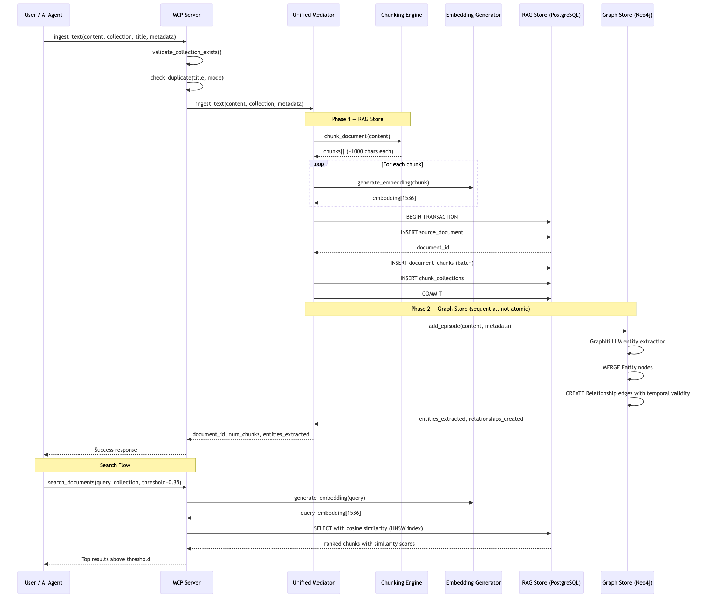
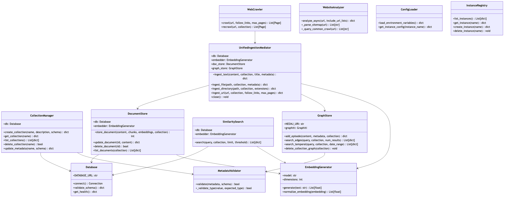

# RAG Memory — Developer Onboarding Guide

**Repository:** codingthefuturewithai/rag-memory  
**Profile:** Developer Onboarding  
**Generated:** 2026-04-29  
**Purpose:** Comprehensive guide for new developers joining the RAG Memory project

---

## Table of Contents

1. [What Is RAG Memory?](#1-what-is-rag-memory)
2. [Technology Stack](#2-technology-stack)
3. [System Architecture Overview](#3-system-architecture-overview)
4. [Repository Structure — Navigation Guide](#4-repository-structure--navigation-guide)
5. [Development Environment Setup](#5-development-environment-setup)
6. [Three Interfaces: Web, MCP, and CLI](#6-three-interfaces-web-mcp-and-cli)
7. [Core Concepts and Data Model](#7-core-concepts-and-data-model)
8. [Key Code Modules — Deep Dive](#8-key-code-modules--deep-dive)
9. [Data Flows and Key Workflows](#9-data-flows-and-key-workflows)
10. [Design Patterns Used in This Codebase](#10-design-patterns-used-in-this-codebase)
11. [Configuration System](#11-configuration-system)
12. [Database and Migrations](#12-database-and-migrations)
13. [Testing Strategy](#13-testing-strategy)
14. [Frontend Architecture](#14-frontend-architecture)
15. [Backend (Web Interface) Architecture](#15-backend-web-interface-architecture)
16. [Multi-Instance Support](#16-multi-instance-support)
17. [CI/CD and GitHub Workflows](#17-cicd-and-github-workflows)
18. [Common Developer Tasks](#18-common-developer-tasks)
19. [Troubleshooting for Developers](#19-troubleshooting-for-developers)
20. [Glossary of Key Terms](#20-glossary-of-key-terms)

---

## 1. What Is RAG Memory?

RAG Memory is a **production-ready knowledge management system** that combines two powerful database technologies to give AI agents and developers comprehensive retrieval capabilities:

- **PostgreSQL + pgvector**: Semantic search over document content using vector embeddings (the "RAG layer" — Retrieval-Augmented Generation)
- **Neo4j + Graphiti**: Entity relationship graphs and temporal knowledge tracking (the "Graph layer")

Both databases work together automatically. When you ingest a document, RAG Memory writes to both systems simultaneously — the document is chunked and embedded for semantic search, while Graphiti uses an LLM to extract entity relationships for the knowledge graph.

### Why Does This Exist?

Standard RAG systems (vector databases alone) are excellent at finding relevant passages but cannot answer questions like "how does concept X relate to concept Y?" or "how has this knowledge evolved over time?" By pairing a vector store with a knowledge graph, RAG Memory supports:

- **"What does the documentation say about X?"** → Vector similarity search (RAG)
- **"How does X relate to Y?"** → Knowledge graph relationship query
- **"How has this concept changed since last year?"** → Temporal graph query

### Three Ways to Use It

| Interface | Tech | Port | Best For |
|-----------|------|------|----------|
| Web UI | React 19 + FastAPI | 5173 (frontend) / 8000 (backend) | Interactive exploration, visual knowledge management |
| MCP Server | FastMCP (20 tools) | 3001 | Claude Desktop, Claude Code, Cursor, AI integrations |
| CLI | Click + Rich (`rag` command) | — | Scripting, automation, bulk operations |

---

## 2. Technology Stack

Understanding the full stack is essential before diving into the code.

### Core Infrastructure

| Component | Technology | Version | Purpose |
|-----------|-----------|---------|---------|
| Vector Database | PostgreSQL + pgvector | 17 + latest | Semantic search with HNSW indexing |
| Knowledge Graph | Neo4j + Graphiti | Latest | Entity relationships and temporal facts |
| Embedding Model | OpenAI text-embedding-3-small | — | 1536-dimensional vector embeddings |
| Container Runtime | Docker + Docker Compose | — | Database services and deployment |
| Python Package Manager | uv (Astral) | — | Fast dependency resolution |
| Python Version | 3.12+ | — | Required by pyproject.toml |

### MCP Server + CLI

| Component | Technology | Purpose |
|-----------|-----------|---------|
| MCP Framework | FastMCP (Anthropic) | Expose 20 tools via Model Context Protocol |
| CLI Framework | Click + Rich | 10 command groups for terminal use |
| Web Crawling | Crawl4AI + Playwright | Scraping and link-following |
| LLM (Graph) | OpenAI API (via Graphiti) | Entity extraction for knowledge graph |

### Web Interface (Backend)

| Component | Technology | Purpose |
|-----------|-----------|---------|
| Web Framework | FastAPI | REST API and SSE streaming |
| Agent Framework | LangGraph + LangChain | ReAct agent with 20 dynamic tools |
| DB ORM | SQLAlchemy (async) | Conversations and messages persistence |
| Migrations | Alembic | Schema version management |
| Conversation State | LangGraph PostgresSaver | Checkpoint-based conversation history |

### Web Interface (Frontend)

| Component | Technology | Purpose |
|-----------|-----------|---------|
| UI Framework | React 19 | Component-based UI |
| Component Library | Mantine UI | Pre-built accessible components |
| Build Tool | Vite | Fast HMR development server |
| State Management | Zustand (`store.ts`) | Global app state |
| API Communication | SSE (Server-Sent Events) | Real-time streaming responses |
| Type Safety | TypeScript | Static typing throughout |
| Testing | Vitest + Testing Library | Unit and component tests |

---

## 3. System Architecture Overview



The architecture follows a clear layered model:

1. **Client Layer** — Users (browser, CLI) and AI agents (via MCP protocol)
2. **Interface Layer** — Three entry points: Web Frontend, MCP Server, CLI
3. **Processing Layer** — Business logic: the Unified Mediator, chunking, embedding, web crawling
4. **Storage Layer** — PostgreSQL (vectors) and Neo4j (graphs)
5. **Configuration** — Three-tier priority system (see Section 11)

### Key Architectural Decisions

**Why a Unified Mediator?** Rather than letting the MCP Server and CLI each write to databases independently, all content ingestion goes through `UnifiedIngestionMediator`. This single entry point guarantees both RAG and Graph stores stay synchronized. It's the most important class to understand as a developer — every `ingest_*` operation flows through it.

**Why Sequential (not Atomic) Dual Writes?** The Mediator currently writes to PostgreSQL first (Phase 1), then to Neo4j (Phase 2). If Neo4j extraction fails, the PostgreSQL data remains. The code comments explicitly note this as a known limitation with a future enhancement ticket for two-phase commit atomicity.

**Why FastMCP?** FastMCP (Anthropic's Python MCP library) dramatically reduces boilerplate for exposing Python functions as MCP tools. The `tools.py` file implements all 20 tools as `*_impl()` functions, and `server.py` wraps them with `@mcp.tool()` decorators.

---

## 4. Repository Structure — Navigation Guide

```
rag-memory/
├── mcp-server/                 ← PRIMARY: MCP server, CLI, and core logic
│   └── src/
│       ├── core/               ← Database, embeddings, config, collections
│       ├── ingestion/          ← Document store, web crawler, metadata validation
│       ├── retrieval/          ← Vector similarity search
│       ├── unified/            ← Unified Mediator + Graph Store (KEY FILES)
│       ├── mcp/                ← 20 MCP tool implementations + HTTP routes
│       └── cli_commands/       ← 10 CLI command groups
│
├── backend/                    ← Web Interface backend
│   └── app/
│       ├── main.py             ← FastAPI app entry point
│       ├── rag/                ← RAG endpoints and MCP proxy
│       ├── rag_agent/          ← LangGraph ReAct agent
│       ├── shared/             ← Chat persistence (conversations, checkpointer)
│       └── tools/              ← Web search and UI tools for the agent
│
├── frontend/                   ← React 19 web application
│   └── src/rag/
│       ├── components/         ← All UI components (chat, sidebar, dashboard)
│       ├── store.ts            ← Zustand global state (CRITICAL)
│       ├── ragApi.ts           ← API client functions
│       ├── api.ts              ← SSE streaming client
│       └── types.ts            ← TypeScript type definitions
│
├── deploy/                     ← Docker, compose files, and deploy-time migrations
│   ├── docker/compose/         ← docker-compose files for dev/prod
│   └── alembic/versions/       ← Deploy-time DB migration scripts
│
├── scripts/                    ← Setup and maintenance scripts
│   ├── setup.py               ← Interactive setup wizard (run first!)
│   ├── deploy_to_cloud.py     ← Cloud deployment helper
│   └── db_migrate.py          ← Multi-instance migration runner
│
├── config/                     ← YAML configuration files
│   ├── config.yaml            ← Active config (gitignored in some setups)
│   └── config.example.yaml    ← Template to copy
│
├── docs/                       ← Developer-focused documentation
│   ├── ARCHITECTURE.md        ← System design (read this first!)
│   ├── FLOWS.md               ← Detailed sequence diagrams
│   ├── DATABASE_MIGRATION_GUIDE.md
│   └── ENVIRONMENT_VARIABLES.md
│
├── .reference/                 ← User-facing documentation (not developer docs)
│   ├── MCP_GUIDE.md           ← All 20 MCP tools with examples
│   ├── CLI_GUIDE.md           ← CLI command reference
│   ├── WEB_INTERFACE.md       ← Web UI documentation
│   └── INSTALLATION.md        ← End-user setup guide
│
├── .claude/                    ← Claude Code integration
│   └── commands/              ← Slash commands (/getting-started, /dev-onboarding, etc.)
│
├── manage.py                   ← Web interface service orchestrator
├── pyproject.toml              ← Python project config (uv manages dependencies)
├── CLAUDE.md                   ← Development guide for Claude Code users
└── SETUP.md                    ← Quick web interface setup reference
```

### Where to Start for Common Tasks

| Task | Start Here |
|------|-----------|
| Add a new MCP tool | `mcp-server/src/mcp/tools.py` + `mcp-server/src/mcp/server.py` |
| Fix ingestion logic | `mcp-server/src/unified/mediator.py` |
| Fix vector search | `mcp-server/src/retrieval/search.py` |
| Fix knowledge graph | `mcp-server/src/unified/graph_store.py` |
| Add a CLI command | `mcp-server/src/cli_commands/` (create new file or extend existing) |
| Fix web UI component | `frontend/src/rag/components/` |
| Fix state management | `frontend/src/rag/store.ts` |
| Fix API call | `frontend/src/rag/ragApi.ts` |
| Fix backend endpoint | `backend/app/rag/router.py` |
| Fix agent behavior | `backend/app/rag_agent/agent.py` + `prompts.py` |
| Change DB schema | `deploy/alembic/versions/` (new migration file) |

---

## 5. Development Environment Setup

### Prerequisites

Before starting, ensure you have:

- **Docker Desktop** installed and running
- **uv** Python package manager: `curl -LsSf https://astral.sh/uv/install.sh | sh`
- **Node.js 18+** (for frontend development)
- **OpenAI API Key** (required for embeddings and graph entity extraction)
- **Git**

### Option A: Interactive Setup (Recommended for New Developers)

```bash
# Clone the repository
git clone https://github.com/codingthefuturewithai/rag-memory.git
cd rag-memory

# Open in Claude Code (or Cursor)
claude  # or: cursor .

# Run the interactive setup slash command
/getting-started
```

The `/getting-started` command walks you through all setup steps interactively.

### Option B: Web Interface Setup

```bash
git clone https://github.com/codingthefuturewithai/rag-memory.git
cd rag-memory

# Copy backend environment file
cp backend/.env.example backend/.env
# Edit backend/.env and set OPENAI_API_KEY=sk-...

# One-time setup (installs dependencies, starts DB, runs migrations)
python manage.py setup --seed

# Start all services
python manage.py start
```

Access the web interface at: http://localhost:5173

### Option C: MCP Server + CLI Setup

```bash
git clone https://github.com/codingthefuturewithai/rag-memory.git
cd rag-memory

# Install Python dependencies
uv sync

# Run interactive setup (starts Docker services, prompts for API key)
python scripts/setup.py
```

After setup, the `rag` CLI command is available:

```bash
rag status          # Verify connection
rag collection list  # List collections
```

### Environment Variables Reference

| Variable | Required | Default | Description |
|----------|----------|---------|-------------|
| `OPENAI_API_KEY` | ✅ Yes | — | For embeddings and graph entity extraction |
| `DATABASE_URL` | ✅ Yes | set by setup | PostgreSQL connection string |
| `NEO4J_URI` | ✅ Yes | set by setup | Neo4j Bolt URI |
| `NEO4J_USER` | ✅ Yes | `neo4j` | Neo4j username |
| `NEO4J_PASSWORD` | ✅ Yes | set by setup | Neo4j password |

### Running Tests

```bash
# All tests
uv run pytest

# MCP server tests only
uv run pytest mcp-server/tests/

# Specific test file
uv run pytest mcp-server/tests/unit/test_chunking_comprehensive.py

# Integration tests (requires running databases)
uv run pytest mcp-server/tests/integration/

# Frontend tests
cd frontend && npm test
```

### Code Quality

```bash
# Format Python code
uv run black mcp-server/src/ mcp-server/tests/

# Lint Python code
uv run ruff check mcp-server/src/ mcp-server/tests/

# Frontend lint
cd frontend && npm run lint
```

---

## 6. Three Interfaces: Web, MCP, and CLI

### 6.1 MCP Server (Primary Interface for AI Agents)

The MCP Server is the heart of the project. It exposes 20 tools via the [Model Context Protocol](https://modelcontextprotocol.io/) — a standardized way for AI agents (Claude, GPT, etc.) to call functions in external systems.

**Entry Point:** `mcp-server/src/mcp/server.py`

The server uses FastMCP's lifespan pattern to initialize all components on startup:

```python
@asynccontextmanager
async def lifespan(app):
    # 1. Load configuration (3-tier priority system)
    load_environment_variables()
    
    # 2. Initialize database (fail-fast if unavailable)
    db = get_database()
    db.validate_schema()  # Checks tables + pgvector + HNSW indexes
    
    # 3. Initialize graph store (fail-fast if unavailable)
    graph_store = GraphStore(...)
    await graph_store.validate_schema()
    
    # 4. Initialize all other components
    # (embedder, collection_manager, document_store, mediator, search)
    yield
```

**Connecting AI Agents to MCP Server:**

```bash
# Claude Code
claude mcp add rag-memory --type sse --url http://localhost:3001/sse

# Claude Desktop — add to ~/Library/Application Support/Claude/claude_desktop_config.json
{
  "mcpServers": {
    "rag-memory": {
      "command": "rag-mcp-stdio",
      "args": []
    }
  }
}
```

### 6.2 CLI Tool (For Developers and Automation)

The CLI uses Click's command group pattern. The entry point is `mcp-server/src/cli.py` which registers all 10 command groups.

```bash
rag --help                # Show all command groups
rag instance --help       # Multi-instance management
rag collection --help     # Collection management
rag ingest --help         # Content ingestion
rag search --help         # Semantic search
rag graph --help          # Knowledge graph queries
```

**Key principle:** The CLI commands are thin wrappers. The actual logic lives in `cli_commands/*.py`. The CLI code should read like a routing table, not contain business logic.

### 6.3 Web Interface (Interactive Exploration)

The web interface consists of two processes:

1. **Frontend** (`frontend/`) — React 19 + Mantine UI, Vite build, port 5173
2. **Backend** (`backend/`) — FastAPI + LangGraph, port 8000

The backend does **not** implement RAG logic directly. Instead, it proxies calls to the MCP Server (port 3001) through `backend/app/rag/mcp_proxy.py`. The MCP Server is the single source of truth for all knowledge operations.

**Service orchestration via manage.py:**

```bash
python manage.py start    # Start: DB container + backend process + frontend process
python manage.py stop     # Stop all
python manage.py status   # Check health of all services
python manage.py logs     # Tail combined logs
python manage.py migrate  # Run pending Alembic migrations
```

---

## 7. Core Concepts and Data Model

### 7.1 Collections

A **Collection** is a named, described grouping of documents. Think of it as a folder or topic bucket.

- **Required description** (enforced by NOT NULL database constraint)
- Documents can belong to **multiple collections** (many-to-many)
- Search can be **scoped to a collection** for focused retrieval
- Each collection has an **isolated knowledge graph** (no cross-collection entity relationships)
- Collections support optional **metadata schemas** (JSON-typed field validation)

```sql
CREATE TABLE collections (
    id SERIAL PRIMARY KEY,
    name VARCHAR(255) UNIQUE NOT NULL,
    description TEXT NOT NULL CHECK (length(trim(description)) > 0),
    metadata_schema JSON NOT NULL DEFAULT '{"custom": {}, "system": []}',
    created_at TIMESTAMP DEFAULT NOW()
);
```

### 7.2 Source Documents and Chunks

When a document is ingested, it is stored in two places in PostgreSQL:

1. **`source_documents`** — The complete original document (for full retrieval)
2. **`document_chunks`** — Overlapping segments with vector embeddings (for search)

Chunking strategy: hierarchical text splitting (headers → paragraphs → sentences), targeting ~1000 characters per chunk with 200-character overlap. Each chunk is independently searchable.

```sql
CREATE TABLE source_documents (
    id SERIAL PRIMARY KEY,
    filename VARCHAR(500) NOT NULL,
    content TEXT NOT NULL,
    file_type VARCHAR(50),
    metadata JSON DEFAULT '{}'
);

CREATE TABLE document_chunks (
    id SERIAL PRIMARY KEY,
    source_document_id INTEGER REFERENCES source_documents(id) ON DELETE CASCADE,
    chunk_index INTEGER NOT NULL,
    content TEXT NOT NULL,
    embedding VECTOR(1536),  -- pgvector: OpenAI text-embedding-3-small
    metadata JSON DEFAULT '{}'
);

-- HNSW index for fast approximate nearest neighbor search
CREATE INDEX ON document_chunks USING hnsw (embedding vector_cosine_ops)
WITH (m = 16, ef_construction = 64);
```

### 7.3 Knowledge Graph (Neo4j + Graphiti)

The knowledge graph stores **entities** (people, concepts, places) and **relationships** (facts connecting entities) extracted from ingested content using LLM-powered entity extraction via the Graphiti library.

Key feature: **temporal facts** — every relationship has `valid_from` and `valid_until` timestamps. When new information supersedes old information, the old fact's `valid_until` is set, and a new fact is created. This enables "how has X evolved over time?" queries.

### 7.4 The Dual Storage Guarantee

Every ingestion call goes through `UnifiedIngestionMediator`, which sequentially:
1. Writes chunks + embeddings to PostgreSQL (RAG store)
2. Extracts entities + relationships into Neo4j (Graph store)

**Important caveat:** This is sequential, not atomic. If step 2 fails, step 1's data persists. The code explicitly documents this limitation in `mediator.py`.

---

## 8. Key Code Modules — Deep Dive

### 8.1 `mcp-server/src/mcp/tools.py` (Most Critical File)

This is the largest and most complex file in the codebase (importance score: 1232.8, ~3762 lines, 47 functions). It contains the `*_impl()` implementations for all 20 MCP tools.

Every tool follows this pattern:
1. Validate inputs (collection exists, required fields present)
2. Call business logic (via Mediator, DocumentStore, or Search)
3. Return structured response

Example mental model: `tools.py` is the "controller" layer. Business logic is in `mediator.py`, `search.py`, `document_store.py`, and `graph_store.py`.

### 8.2 `mcp-server/src/unified/mediator.py`

The `UnifiedIngestionMediator` class is the core orchestrator. All four ingestion paths flow through it:

- `ingest_text()` — Direct text content
- `ingest_file()` — From filesystem path
- `ingest_directory()` — Batch from directory
- `ingest_url()` — Web crawl + ingest

**Key dependency pattern:**
```python
class UnifiedIngestionMediator:
    def __init__(self, db, embedder, doc_store, graph_store):
        self.db = db
        self.embedder = embedder
        self.doc_store = doc_store
        self.graph_store = graph_store
```

All dependencies are injected — no global singletons. This makes testing straightforward.

### 8.3 `mcp-server/src/retrieval/search.py`

Implements vector similarity search. The core query uses PostgreSQL's pgvector `<=>` cosine distance operator:

```sql
SELECT content, metadata, 1 - (embedding <=> %s) AS similarity
FROM document_chunks
JOIN chunk_collections ON ...
WHERE collection_id = %s
  AND 1 - (embedding <=> %s) >= %s  -- threshold filter
ORDER BY embedding <=> %s            -- HNSW index used here
LIMIT %s
```

Default similarity threshold: **0.35**. Adjustable per-query.

### 8.4 `mcp-server/src/unified/graph_store.py`

Wraps Neo4j + Graphiti operations. Key methods:
- `add_episode()` — Sends content to Graphiti for LLM-powered entity extraction
- `search_edges()` — Relationship queries with LLM-based entity matching
- `search_temporal()` — Time-windowed fact queries
- `delete_collection_graph()` — Removes all graph data for a collection on deletion

**Important:** Every entity in the graph is tagged with its collection name to provide isolation between collections.

### 8.5 `mcp-server/src/core/config_loader.py`

Implements the 3-tier configuration priority system (see Section 11). The `load_environment_variables()` function is called at startup and populates `os.environ` so the rest of the application just uses `os.getenv()`.

### 8.6 `mcp-server/src/ingestion/web_crawler.py`

Uses Crawl4AI (Playwright-based) for robust web scraping. Two modes:
- `mode="ingest"` — Fresh crawl, raises error if URL already ingested
- `mode="reingest"` — Update mode, deletes existing pages for this URL first

Features: link following (configurable depth + max pages), content filtering (removes nav/footer noise), crawl metadata tracking (root URL, session ID, depth).

### 8.7 `frontend/src/rag/store.ts` (Frontend's Most Critical File)

The Zustand store is the single source of truth for all frontend state. With 48 functions and 742 lines, it's the frontend equivalent of `tools.py`.

Key state slices:
- Collections, Documents, SearchResults
- Chat: messages, streamingContent, pendingTools
- UI: selectedView, modals open/closed
- SSE: active streaming connection

The store directly manages the SSE connection lifecycle via `ChatSSEClient` (from `api.ts`).

### 8.8 `backend/app/rag_agent/agent.py` + `prompts.py`

The web interface's ReAct agent built on LangGraph. It dynamically selects from all 20 MCP tools to answer user questions. The system prompt in `prompts.py` is carefully crafted to:
- Prevent hallucination (only claim to do what tools support)
- Guide tool selection (use `search_documents` for content, graph tools for relationships)
- Handle the tool proposal pattern (some actions require human approval before execution)

---

## 9. Data Flows and Key Workflows

### 9.1 Ingest + Search (The Core Loop)



The sequence diagram above shows the two most critical flows:

1. **Ingestion**: User → MCP Server → Unified Mediator → [Chunker → Embedder → PostgreSQL] then [Graphiti → Neo4j]
2. **Search**: User → MCP Server → Embedder (query vectorization) → PostgreSQL HNSW query → ranked results

### 9.2 Web Crawl Flow

Web URL ingestion follows the same pattern but adds a pre-step: the `WebCrawler` fetches pages (optionally following links up to `max_depth`), then passes each page through the Unified Mediator.

The `Deduplication` module (`mcp-server/src/mcp/deduplication.py`) prevents concurrent identical requests to the same URL from triggering duplicate ingestions.

### 9.3 Startup Validation Flow

The MCP server uses a **fail-fast** design: it will refuse to start if either PostgreSQL or Neo4j is unavailable or has an invalid schema. This prevents subtle errors at query time. The startup sequence:

1. Load configuration (3-tier system)
2. Test PostgreSQL connection + validate schema (tables, pgvector extension, HNSW index)
3. Test Neo4j connection + validate graph schema
4. Initialize remaining components
5. Expose `/health` endpoint

### 9.4 Web Interface Chat Flow

```
User types message
    → Frontend store.ts sends via SSE (ChatSSEClient)
    → Backend FastAPI endpoint receives
    → LangGraph ReAct agent selects tools
    → Agent calls MCP proxy (backend/app/rag/mcp_proxy.py)
    → MCP proxy calls MCP Server on port 3001
    → MCP Server executes tool (search, ingest, etc.)
    → Results stream back via SSE events
    → Frontend store.ts processes SSE events (token, tool_start, tool_end, etc.)
    → React components re-render with streamed content
```

---

## 10. Design Patterns Used in This Codebase

### 10.1 Thin Orchestrator Pattern

Entry points (`cli.py`, `server.py`, `main.py`) are intentionally thin. They register routes/commands and delegate immediately to implementation modules. This keeps entry points easy to read and business logic easy to test in isolation.

### 10.2 Dependency Injection via Constructors

Components receive their dependencies through constructors — no module-level singletons. Example: `UnifiedIngestionMediator(db, embedder, doc_store, graph_store)`. This makes unit testing straightforward with mock objects.

### 10.3 `*_impl()` Tool Pattern (MCP Server)

All 20 MCP tools are implemented as `tool_name_impl()` functions in `tools.py`. The `server.py` wraps them with `@mcp.tool()` decorators. This separation:
- Allows the same implementation to be called by both the MCP server and tests
- Keeps `server.py` as a thin routing layer
- Makes tools individually testable without MCP protocol overhead

### 10.4 Single Responsibility Modules

Each module in `mcp-server/src/` has one clear purpose:
- `core/database.py` — Only connection + schema validation
- `core/embeddings.py` — Only embedding generation + normalization
- `ingestion/document_store.py` — Only PostgreSQL write operations
- `retrieval/search.py` — Only vector similarity queries
- `unified/mediator.py` — Only orchestration

### 10.5 SSE Streaming Pattern (Frontend)

The frontend uses Server-Sent Events (not WebSockets) for streaming chat responses. The `ChatSSEClient` class in `api.ts` implements a clean lifecycle:
- `open()` — Establishes SSE connection with fetch + ReadableStream
- Event handlers: `onToken`, `onToolStart`, `onToolEnd`, `onDone`, `onError`
- `close()` — Aborts the connection via `AbortController`

The Zustand store subscribes to these events and updates state reactively.

### 10.6 Tool Proposal Pattern (Human-in-the-Loop)

The web interface implements a human-in-the-loop pattern for destructive operations (delete, reingest). When the agent wants to perform such an action:
1. It emits a `tool_proposal` SSE event
2. The frontend shows a `ToolProposalCard` with approve/reject buttons
3. Only on approval does the actual tool execute

This is implemented via `ToolProposalCard.tsx` in the frontend and the `tool_proposal` event type in `types.ts`.

---

## 11. Configuration System

RAG Memory uses a **three-tier priority system** for configuration. Higher-priority sources override lower ones:

```
1. Environment Variables    (highest)  — for Docker, CI/CD, production
2. Project .env File        (middle)   — for local development
3. System Config (~/.config/rag-memory/config.yaml) (lowest) — for end-users
```

**Key module:** `mcp-server/src/core/config_loader.py`

The `load_environment_variables()` function at startup:
1. Checks if `DATABASE_URL`, `OPENAI_API_KEY`, etc. are set in the environment
2. If not, reads the project `.env` file (from `deploy/docker/compose/.env`)
3. If still not found, reads the system YAML config
4. If none found — exits with an error message guiding the user

**For developers:** During development, use the project `.env` file in `deploy/docker/compose/`. Never commit secrets.

**For MCP client connections (Claude Desktop, etc.):** Configuration must be provided in the MCP client config's `env` section, as the MCP Server reads from environment variables.

---

## 12. Database and Migrations

### 12.1 Two Migration Systems

This project has two separate Alembic migration trees — one for the MCP/deploy schema, one for the web interface backend schema:

| Migration Tree | Location | Manages |
|---------------|----------|---------|
| Deploy (MCP) | `deploy/alembic/versions/` | `source_documents`, `document_chunks`, `collections`, `chunk_collections` |
| Backend (Web) | `backend/alembic/versions/` | `conversations`, `messages`, `starter_prompts` |
| LangGraph | Managed by `PostgresSaver` script | `checkpoints`, `checkpoint_writes`, `checkpoint_blobs` |

### 12.2 Adding a Database Migration

For the **deploy schema** (MCP/core tables):

```bash
cd deploy
alembic revision --autogenerate -m "add_new_field"
# Review generated file in deploy/alembic/versions/
cd ..
uv run python scripts/db_migrate.py  # Apply to all instances
```

For the **backend schema** (web interface tables):

```bash
cd backend
alembic revision --autogenerate -m "add_field_to_conversations"
cd ..
python manage.py migrate
```

### 12.3 Key Migration History

| File | Description |
|------|-------------|
| `001_baseline_fresh_schema.py` | Initial tables: collections, source_documents, chunks |
| `002_add_trust_system.py` | Adds trust/review fields to documents |
| `003_add_evaluation_system.py` | Adds quality scoring fields |
| `004_rename_topic_used_to_topic_provided.py` | Field rename |
| `005_add_content_hash.py` | Deduplication via content hashing |

### 12.4 Multi-Instance Database Management

With multi-instance support (see Section 16), each instance has its own PostgreSQL database. The script `scripts/db_migrate.py` applies migrations across all instances.

---

## 13. Testing Strategy

### 13.1 Test Structure

```
mcp-server/tests/
├── unit/                       # Fast, isolated, no DB required
│   ├── test_chunking_comprehensive.py  # ~49 tests
│   ├── test_metadata_validator.py      # ~47 tests
│   ├── test_database_health.py         # ~37 tests
│   ├── test_graph_store.py             # ~27 tests
│   ├── test_instance_registry.py       # ~39 tests
│   └── ...
│
├── integration/                # Requires running PostgreSQL + Neo4j
│   ├── mcp/                    # Full MCP tool integration tests
│   │   ├── test_ingestion.py
│   │   ├── test_search_documents.py
│   │   ├── test_collections.py
│   │   ├── test_reingest_modes.py  # ~19 test cases for crawl modes
│   │   └── test_knowledge_graph.py
│   ├── backend/                # Document chunking + graph tests
│   └── web/                    # Web crawler integration tests
│
└── conftest.py                 # Shared fixtures (DB setup, test collections)
```

```
frontend/tests/
├── components/                 # Vitest + Testing Library component tests
│   ├── CollectionBrowser.test.tsx  # ~73 tests
│   ├── ConversationSidebar.test.tsx
│   └── ...
├── unit/
│   ├── store.test.ts           # Zustand store unit tests (~102 tests)
│   ├── ragApi.test.ts          # API client unit tests
│   └── sseClient.test.ts       # SSE client unit tests (~90 tests)
└── integration/
    └── chat-streaming.test.tsx  # End-to-end streaming simulation
```

### 13.2 Key Testing Patterns

**MCP Integration Tests:** Use a `conftest.py` that creates an isolated test database and tears it down after each test session. The helper `extract_text_content(result)` parses MCP tool responses (which return `TextContent` objects, not plain strings).

**Frontend Store Tests:** Reset Zustand state in `beforeEach`:
```typescript
useRagStore.getState().reset();
useRagStore.setState({ collections: [], documents: [], ... });
```

**Web Tests:** Use MSW (Mock Service Worker) to intercept API calls. Handlers are in `frontend/tests/mocks/handlers.ts`.

### 13.3 Running Specific Test Categories

```bash
# Unit tests only (fast, no DB required)
uv run pytest mcp-server/tests/unit/

# Integration tests (needs running Docker services)
uv run pytest mcp-server/tests/integration/mcp/

# Web crawling tests
uv run pytest mcp-server/tests/integration/web/

# Frontend unit tests
cd frontend && npx vitest run tests/unit/

# Frontend component tests
cd frontend && npx vitest run tests/components/
```

---

## 14. Frontend Architecture

### 14.1 Application Layout

The frontend uses a 3-column layout managed by `AppLayout.tsx`:

```
┌──────────────────────────────────────────────────────┐
│                     TopBar.tsx                        │
├─────────────┬──────────────────────┬─────────────────┤
│  Left Nav   │    Main Content      │  Right Panel    │
│  (sidebar)  │  (selected view)     │  (currently     │
│             │                      │   empty/future) │
│ Collections │  Chat / Dashboard /  │                 │
│ Navigation  │  Documents / Search  │                 │
└─────────────┴──────────────────────┴─────────────────┘
```

Views (controlled by `store.ts` `selectedView`):
- `chat` — Chat interface with streaming responses
- `dashboard` — Analytics and stats charts
- `documents` — Document browser
- `search` — Direct semantic search UI
- `collections` — Collection browser

### 14.2 State Management (Zustand)

`frontend/src/rag/store.ts` is the central nervous system of the frontend. Key state:

```typescript
// Collections and Documents
collections: Collection[]
documents: Document[]
selectedCollectionId: string | null

// Chat
messages: Message[]
streamingContent: string
isStreaming: boolean
pendingTools: PendingTool[]  // for tool proposal pattern

// Search
searchResults: SearchResult[]
relationships: Relationship[]
timeline: TemporalResult[]

// UI
selectedView: View
modals: { ingestion: boolean, document: boolean, ... }
```

Important store actions for developers to understand:
- `sendMessage()` — Initiates a chat message via SSE
- `approvePendingTools()` — Approves a tool proposal for execution
- `rejectPendingTools()` — Cancels a pending tool action
- `fetchCollections()` / `fetchDocuments()` — Load data from API

### 14.3 API Layer

**`ragApi.ts`** — REST API functions (collections, documents, search, etc.)  
**`api.ts`** — The `ChatSSEClient` class for SSE streaming

The `ChatSSEClient` uses `fetch()` with a `ReadableStream` to handle SSE. This is preferable over `EventSource` because it supports `POST` requests (needed for sending message content).

### 14.4 Key Frontend Components

| Component | File | Purpose |
|-----------|------|---------|
| `IngestionModal` | `modals/IngestionModal.tsx` | Multi-tab modal (text/URL/file/directory) with agent defaults |
| `CollectionBrowser` | `components/CollectionBrowser.tsx` | Collection list with selection |
| `ConversationSidebar` | `components/ConversationSidebar.tsx` | Conversation history grouped by date |
| `KnowledgeGraphView` | `components/KnowledgeGraphView.tsx` | Graph visualization with relationships + timeline |
| `ToolProposalCard` | `components/ToolProposalCard.tsx` | Human-in-the-loop approval UI |
| `DashboardView` | `components/dashboard/DashboardView.tsx` | Analytics with charts (Mantine Charts) |

---

## 15. Backend (Web Interface) Architecture

### 15.1 FastAPI Application (`backend/app/main.py`)

The FastAPI app has two routers:
- `rag_router` (`backend/app/rag/router.py`) — REST endpoints for collections, documents, conversations
- `mcp_proxy_router` (`backend/app/rag/mcp_proxy.py`) — Proxies MCP tool calls to the MCP Server

On startup, `main.py` runs Alembic migrations and seeds starter prompts (idempotent).

### 15.2 MCP Proxy (`backend/app/rag/mcp_proxy.py`)

The backend does not re-implement RAG logic. Instead, it calls the MCP Server's HTTP endpoints. This is the "single source of truth" principle: all knowledge operations go through the MCP Server even when accessed via the web UI.

### 15.3 LangGraph ReAct Agent (`backend/app/rag_agent/`)

The agent (`agent.py`) is a LangGraph ReAct agent that:
1. Receives user messages
2. Dynamically selects tools from the 20 available MCP tools
3. Executes tools, observes results, and decides next action
4. Streams responses token-by-token via SSE

The system prompt (`prompts.py`) is critical — it defines the agent's persona, constraints, and tool selection strategy. When modifying agent behavior, this is the primary file to edit.

### 15.4 Conversation Persistence (`backend/app/shared/`)

- `chat_bridge.py` — Converts between LangGraph messages and the app's DB schema
- `checkpointer.py` — Wraps `PostgresSaver` for LangGraph checkpoint storage
- `agent_factory.py` — Creates configured agent instances with the right tools and checkpointer

---

## 16. Multi-Instance Support

RAG Memory supports running multiple isolated instances, each with its own PostgreSQL, Neo4j, and MCP server. This is useful for:
- Separating development, staging, and production knowledge bases
- Running isolated knowledge bases for different teams or projects

### Port Allocation

| Instance | PostgreSQL | Neo4j Bolt | Neo4j HTTP | MCP Server |
|----------|-----------|-----------|-----------|-----------|
| Instance 1 (default) | 54320 | 7687 | 7474 | 8000 |
| Instance 2 | 54330 | 7688 | 7475 | 8001 |
| Instance 3 | 54340 | 7689 | 7476 | 8002 |

### Instance Management CLI

```bash
rag instance list                    # List all instances
rag instance start primary           # Start/create "primary" instance
rag instance start research          # Create additional "research" instance
rag instance status primary          # Health and port info
rag instance stop primary            # Stop (preserves data)
rag instance delete research --force # Delete with data
```

### Key Modules for Multi-Instance

- `mcp-server/src/core/instance_registry.py` — Tracks all instances and their configurations
- `mcp-server/src/core/instance_init.py` — Initializes new instance (Docker compose, migrations)
- `mcp-server/src/cli_commands/instance.py` — CLI commands for instance management
- `scripts/db_migrate.py` — Runs migrations across all instances

---

## 17. CI/CD and GitHub Workflows

The repository has two GitHub Actions workflows in `.github/workflows/`:

### `claude.yml` — Claude Code Integration

Triggers on specific GitHub issues and pull request comments mentioning `@claude`. Uses the Claude Code GitHub Action to automate code changes, reviews, and responses.

### `claude-code-review.yml` — Automated Code Review

Triggers on pull request creation/updates. Uses Claude to perform automated code review and post comments.

**For developers:** These workflows require a `CLAUDE_CODE_OAUTH_TOKEN` secret configured in GitHub repository settings.

---

## 18. Common Developer Tasks

### Add a New MCP Tool

1. Implement the tool logic in `mcp-server/src/mcp/tools.py`:
   ```python
   def my_new_tool_impl(param1: str, ..., **components) -> dict:
       # Extract injected components
       db = components['db']
       # ... implement logic
       return {"result": ...}
   ```

2. Register the tool in `mcp-server/src/mcp/server.py`:
   ```python
   @mcp.tool()
   def my_new_tool(param1: str, ctx: Context) -> str:
       result = my_new_tool_impl(param1, **ctx.request_context.lifespan_context)
       return json.dumps(result)
   ```

3. Import and add to the import list in `server.py`

4. Add integration tests in `mcp-server/tests/integration/mcp/`

### Add a New CLI Command

1. Create or extend a file in `mcp-server/src/cli_commands/`:
   ```python
   @cli_group.command()
   @click.argument('name')
   def my_command(name: str):
       """Description shown in --help."""
       # Implement logic, call shared modules
   ```

2. Register the group in `mcp-server/src/cli.py` if it's a new command group

### Change the Chunking Strategy

Edit `mcp-server/src/core/chunking.py`. Key parameters:
- `chunk_size` — Target characters per chunk (default: ~1000)
- `chunk_overlap` — Character overlap between adjacent chunks (default: 200)
- Splitting strategy: hierarchical (headers → paragraphs → sentences)

After changing chunking, existing documents will **not** be automatically re-chunked. You need to re-ingest them with `mode="reingest"`.

### Modify the Agent System Prompt

Edit `backend/app/rag_agent/prompts.py`. The `RAG_MEMORY_SYSTEM_PROMPT` constant defines:
- Agent persona and capabilities
- What the agent CAN and CANNOT do
- Tool selection guidance
- Response formatting rules

### Add a New Frontend View

1. Create the component in `frontend/src/rag/components/views/`
2. Add the view type to `frontend/src/rag/components/layout/AppLayout.tsx`'s `View` type
3. Add navigation item in `frontend/src/rag/components/layout/LeftNavigation.tsx`
4. Handle the view in `frontend/src/rag/components/layout/MainContent.tsx`
5. Add tests in `frontend/tests/components/views/`

### Debug MCP Tool Issues

```bash
# Check MCP server logs
rag instance logs primary --service mcp

# Or from the mcp-server directory
tail -f mcp-server/logs/mcp_server.log

# Test a specific tool via CLI (same underlying implementation)
rag search "your query" --collection my-collection --verbose

# Check database state
rag document list --collection my-collection
rag collection info my-collection
```

---

## 19. Troubleshooting for Developers

### "MCP tools not available" or Server Won't Start

The MCP server fails fast if databases are unavailable. Check:
```bash
# Check Docker containers
docker ps

# Start if not running
rag instance start primary
# or
docker-compose -f deploy/docker/compose/docker-compose.dev.yml up -d

# Check PostgreSQL
docker logs rag-memory-postgres-1

# Check Neo4j
docker logs rag-memory-neo4j-1
```

### Vector Search Returns No Results

The most common cause: search queries are too short or keyword-like. The HNSW similarity threshold is 0.35 by default.

```bash
# Try with lower threshold and verbose output
rag search "How does authentication work in the system?" \
  --collection my-collection \
  --threshold 0.2 \
  --verbose

# Check if collection has documents
rag collection info my-collection
```

### Graph Queries Return Nothing

Graph queries require Neo4j AND that content was ingested with graph extraction enabled. Check:
```bash
# Verify Neo4j is running and connected
rag status

# Re-ingest with explicit collection (graph is scoped to collection)
rag ingest text "sample content" --collection my-collection
rag graph query-relationships "sample query" --collection my-collection
```

### Frontend Build Issues

```bash
cd frontend
rm -rf node_modules
npm install
npm run build
```

### Database Schema Out of Sync

```bash
# Check migration status
cd deploy && alembic current

# Apply pending migrations
python scripts/db_migrate.py

# For web interface schema
python manage.py migrate
```

### Test Database Conflicts

Integration tests create temporary databases. If a test run was interrupted, cleanup may have failed:

```bash
# List test databases
psql $DATABASE_URL -c "\l" | grep test

# Drop orphaned test databases
psql $DATABASE_URL -c "DROP DATABASE test_rag_memory_xxx;"
```

---

## 20. Glossary of Key Terms

| Term | Meaning |
|------|---------|
| **RAG** | Retrieval-Augmented Generation — using a retrieved context (from a knowledge base) to augment an AI model's response |
| **Embedding** | A vector representation of text (1536 floating-point numbers) that captures semantic meaning |
| **Vector Search / Semantic Search** | Finding documents by semantic similarity rather than keyword matching |
| **HNSW** | Hierarchical Navigable Small World — the approximate nearest neighbor index algorithm used by pgvector for fast vector search |
| **pgvector** | PostgreSQL extension that adds vector storage and similarity search capabilities |
| **Cosine Similarity** | The similarity metric used to compare embeddings — higher values (closer to 1.0) mean more similar |
| **Knowledge Graph** | A graph database (Neo4j) storing entities and the relationships between them |
| **Entity** | A named concept extracted from text (person, place, technology, concept) stored as a node in Neo4j |
| **Temporal Fact** | A relationship in the graph that has `valid_from` and `valid_until` timestamps — tracks knowledge evolution |
| **Graphiti** | The Python library (built on LangChain) used for LLM-powered entity extraction and graph management |
| **MCP** | Model Context Protocol — Anthropic's open standard for AI agents to call external tools |
| **FastMCP** | Python library (from Anthropic) that simplifies building MCP servers |
| **ReAct Agent** | A LangGraph agent pattern: Reason + Act — the agent reasons about which tool to use, uses it, observes the result, and repeats |
| **SSE** | Server-Sent Events — a protocol for streaming data from server to browser, used for token-by-token chat responses |
| **Collection** | A named grouping of documents in RAG Memory — analogous to a folder or topic bucket |
| **Chunk** | A segment of a source document (~1000 chars) that is independently embedded and searchable |
| **Source Document** | The complete original document, stored in `source_documents` table for full retrieval |
| **Unified Mediator** | The central orchestrator class that writes to both PostgreSQL and Neo4j for every ingestion |
| **Instance** | An isolated deployment of RAG Memory with its own PostgreSQL and Neo4j databases |

---

## Class Diagram



---

## Quick Reference Card

### Most Important Files

| File | Why It Matters |
|------|---------------|
| `mcp-server/src/mcp/tools.py` | All 20 MCP tool implementations |
| `mcp-server/src/unified/mediator.py` | Core ingestion orchestrator |
| `mcp-server/src/retrieval/search.py` | Vector similarity search |
| `mcp-server/src/unified/graph_store.py` | Knowledge graph operations |
| `mcp-server/src/core/config_loader.py` | 3-tier configuration system |
| `frontend/src/rag/store.ts` | Frontend state management |
| `backend/app/rag_agent/prompts.py` | Agent behavior definition |

### Key Commands for Daily Development

```bash
# Start the full stack (web interface)
python manage.py start

# Start just the MCP/CLI stack
rag instance start primary

# Run all tests
uv run pytest

# Format code
uv run black mcp-server/src/ mcp-server/tests/

# Check health
rag status
python manage.py status

# View logs
rag instance logs primary
python manage.py logs
```

### Common Ports

| Service | Port |
|---------|------|
| React Frontend | 5173 |
| FastAPI Backend | 8000 |
| MCP Server (SSE) | 3001 |
| PostgreSQL | 54320 |
| Neo4j Bolt | 7687 |
| Neo4j HTTP | 7474 |

---

*This developer onboarding guide was generated from the live codebase of codingthefuturewithai/rag-memory on 2026-04-29.*
