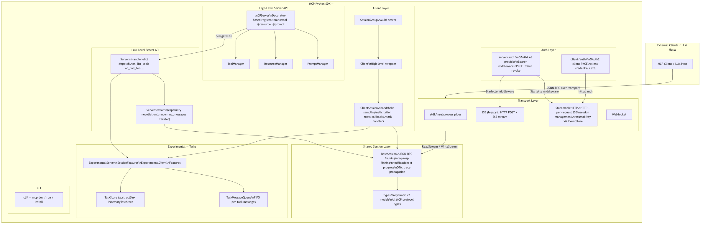
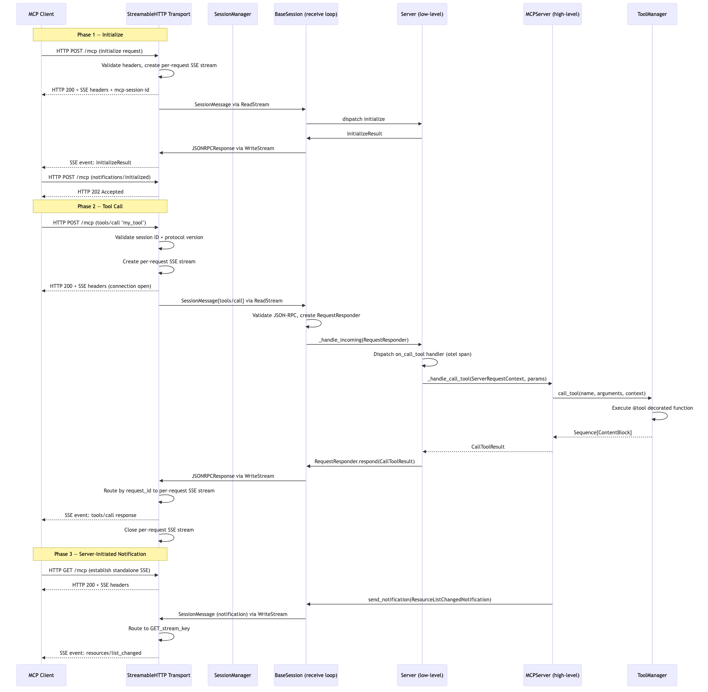
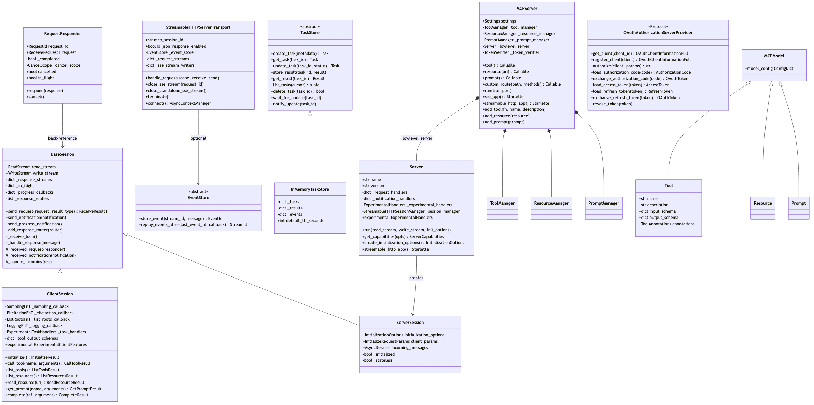

# modelcontextprotocol/python-sdk — Architecture Review

**Analysis Profile:** Architecture Review  
**Audience:** Architects and Technical Leads  
**Generated:** 2026-05-14  
**Repository:** https://github.com/modelcontextprotocol/python-sdk  

---

## Table of Contents

1. [Repository Overview & Purpose](#1-repository-overview--purpose)
2. [High-Level Architecture](#2-high-level-architecture)
3. [Core Components & Module Boundaries](#3-core-components--module-boundaries)
4. [Key Interaction Flows](#4-key-interaction-flows)
5. [Type & Class Model](#5-type--class-model)
6. [Architectural Decisions & Rationale](#6-architectural-decisions--rationale)
7. [Patterns in Use](#7-patterns-in-use)
8. [Extensibility Points](#8-extensibility-points)
9. [Trade-offs & Failure Modes](#9-trade-offs--failure-modes)
10. [Technology Stack Rationale](#10-technology-stack-rationale)
11. [Notable Files Reference](#11-notable-files-reference)

---

## 1. Repository Overview & Purpose

The `modelcontextprotocol/python-sdk` is the **official Python implementation of the Model Context Protocol (MCP)** — an open standard, published under the Linux Foundation umbrella, that defines how AI/LLM-based hosts communicate with external tool and data servers. The protocol is analogous to a language server protocol for AI: it gives any LLM host (Claude, ChatGPT, open-source runners) a standardised wire format for discovering and invoking **tools**, **resources**, and **prompts** hosted by arbitrary third-party processes.

### What This SDK Provides

| Concern | Provided |
|---|---|
| Protocol implementation | Full JSON-RPC 2.0 framing over multiple transports |
| Server authoring | Two-tier API (high-level decorators, low-level handler registration) |
| Client authoring | `ClientSession` + high-level `Client` + multi-server `SessionGroup` |
| Transport adapters | stdio, SSE (legacy), StreamableHTTP (current), WebSocket |
| Authentication | Full OAuth 2.0 Authorization Server + client PKCE flow |
| Observability | W3C trace context propagation via OpenTelemetry |
| Experimental | Async long-running task subsystem |
| Developer tooling | `mcp` CLI for dev/run/install workflows |

The SDK targets Python ≥ 3.10 and is published as the `mcp` package on PyPI. Its maintainers are Anthropic engineers and it is the reference implementation for the protocol alongside the TypeScript SDK.

---

## 2. High-Level Architecture

The architecture is a layered, transport-agnostic protocol stack. The outermost layer is the **transport** (how bytes move), the middle layer is the **session** (how JSON-RPC messages are framed and correlated), and the inner layers are the **server** or **client** logic that handles protocol-level requests.



### Layers at a Glance

```
┌──────────────────────────────────────────────────────────────┐
│  Application Code                                             │
│  @mcp.tool()  @mcp.resource()  @mcp.prompt()                 │
└──────────────────────┬───────────────────────────────────────┘
                       │ MCPServer (high-level)
┌──────────────────────▼───────────────────────────────────────┐
│  Server (low-level) — handler dispatch by method string       │
│  ↕  ServerSession  ↕  ClientSession  ↕                       │
├──────────────────────────────────────────────────────────────┤
│  BaseSession — JSON-RPC framing, req-resp linking, OTel       │
├──────────────────────────────────────────────────────────────┤
│  Transport: stdio | SSE | StreamableHTTP | WebSocket         │
│             ReadStream/WriteStream protocol                   │
└──────────────────────────────────────────────────────────────┘
```

### Key Design Invariant

Every component in the stack communicates exclusively through the two-item pair `(ReadStream[SessionMessage], WriteStream[SessionMessage])`. The `BaseSession` class owns this pair and everyone else is upstream or downstream of it. This means **transport is entirely substitutable** — switching a server from stdio to StreamableHTTP is a single method call on `MCPServer.run()`.

---

## 3. Core Components & Module Boundaries

### 3.1 `src/mcp/types/` — Protocol Type System

**Purpose:** Single source of truth for all MCP protocol types.

- `_types.py` — 1,269 NLOC of Pydantic v2 models defining every request, result, notification, capability, and content block in the protocol. This is the largest single file by pure line count.
- `jsonrpc.py` — `JSONRPCRequest`, `JSONRPCResponse`, `JSONRPCError`, `JSONRPCNotification`, plus a union `TypeAdapter` (`jsonrpc_message_adapter`) used by the transport layer for parsing.

Every other module imports from `mcp.types`. The type layer has **zero upward dependencies** within the package — it is the root of the dependency graph.

**Architectural note:** Using Pydantic v2 for the type layer gives the SDK automatic serialization/deserialization, field validation, and JSON schema generation (for `input_schema` in tool definitions) without any manual marshaling code.

### 3.2 `src/mcp/shared/` — Shared Session Layer

This is the most architecturally significant package because it contains logic used symmetrically by both clients and servers.

#### `session.py` — `BaseSession` (191 NLOC active logic, ~450 total)

The central class of the SDK. It runs a single background `_receive_loop` task (started in `__aenter__`) that continuously reads `SessionMessage` objects from the `ReadStream` and dispatches them:

- **Incoming requests** → wrapped in `RequestResponder` → placed in `_in_flight` dict → forwarded to subclass via `_received_request()` then `_handle_incoming()`
- **Incoming notifications** → validated → `_received_notification()` → `_handle_incoming()`
- **Incoming responses** → matched by `request_id` to a waiting `MemoryObjectSendStream` in `_response_streams`, waking the blocked `send_request()` coroutine

The `send_request()` method is a clean async RPC primitive: it allocates a per-request `MemoryObjectSendStream`, sends the request JSON, then `await`s the response stream. If a timeout fires, it raises `MCPError(code=REQUEST_TIMEOUT)`. If the connection closes while a request is in-flight, `finally` blocks in `_receive_loop` drain all pending response streams with a `CONNECTION_CLOSED` error.

**Progress callbacks:** `send_request()` accepts an optional `progress_callback`. When provided, it injects a `progressToken` into `_meta` and registers the callback in `_progress_callbacks`. Incoming `ProgressNotification` messages then invoke the callback.

**OTel integration:** Both outgoing requests (`send_request`) and incoming request handling (`_handle_request` in `Server`) create spans and propagate W3C trace context in the `_meta` field of request params (SEP-414).

#### `message.py` — `SessionMessage`

A thin dataclass wrapping a `JSONRPCMessage` with optional `metadata`. The `ServerMessageMetadata` variant carries:
- `request_context`: the raw Starlette `Request` object (for HTTP transports)
- `close_sse_stream`: callback to close the per-request SSE stream
- `close_standalone_sse_stream`: callback for the GET-based notification stream
- `related_request_id`: for routing notifications back to a specific SSE stream

This metadata is the mechanism by which the transport layer passes HTTP-specific context up to the application layer without coupling them structurally.

#### `_stream_protocols.py` — Stream Protocols

Defines `ReadStream[T]` and `WriteStream[T]` as structural protocols. Nothing in the session layer imports concrete stream types — only these protocols. This allows `anyio.MemoryObjectStream`, Starlette SSE streams, and custom streams to all satisfy the interface.

#### `_context_streams.py` — `ContextSendStream` / `ContextReceiveStream`

Wrappers that snapshot `contextvars.copy_context()` on every `send()`. This ensures that `contextvars` set in an HTTP request handler (e.g., authenticated user identity from `AuthContextMiddleware`) propagate correctly through async task boundaries to the request handler running in a separate task. This is a subtle but critical correctness concern for auth.

#### `shared/experimental/tasks/` — Task Subsystem

An experimental extension to the MCP protocol supporting **long-running asynchronous operations**. The key abstractions are:

- `TaskStore` (abstract) — CRUD + pagination + `wait_for_update`/`notify_update` for task state. Designed to be backed by any persistence layer.
- `InMemoryTaskStore` — in-process implementation with TTL-based lazy expiry.
- `TaskMessageQueue` (abstract) — FIFO queue for messages generated during task execution (e.g., intermediate `elicit` calls).
- `InMemoryTaskMessageQueue` — in-process implementation; comments explicitly call out Redis/RabbitMQ as distributed alternatives.
- `Resolver[T]` — anyio-compatible promise primitive (replaces `asyncio.Future` to work with both asyncio and trio backends).

### 3.3 `src/mcp/server/` — Server Package

#### `lowlevel/server.py` — `Server`

The low-level server. Its primary data structures are:
- `_request_handlers: dict[str, Callable[[ServerRequestContext, Any], Awaitable[Any]]]`
- `_notification_handlers: dict[str, Callable[[ServerRequestContext, Any], Awaitable[None]]]`

All handler population happens at construction time via `on_*` keyword arguments. Handlers are keyed by MCP method string (e.g., `"tools/call"`, `"resources/list"`). `Server.run()` enters a `ServerSession`, then runs an `anyio.create_task_group()` loop that concurrently dispatches each incoming message to its handler. Concurrency is inherent: multiple tool calls can execute simultaneously unless the handler implementation serialises them.

The `Server.get_capabilities()` method **derives capabilities from registered handlers** — if no `on_list_tools` handler is registered, the server won't advertise `tools` capability. This is a clean convention that prevents capability/implementation drift.

`Server.streamable_http_app()` creates a full Starlette ASGI application with session management, auth middleware, and the transport endpoint wired together.

#### `session.py` — `ServerSession`

Extends `BaseSession`. Handles the MCP initialization handshake: it expects the first message to be an `InitializeRequest`, responds with `InitializeResult`, then waits for `InitializedNotification`. After that, it surfaces incoming messages via `incoming_messages` async iterator. In stateless mode (`stateless=True`), it allows clients to initialize with any server node — important for horizontally-scaled deployments.

#### `mcpserver/server.py` — `MCPServer`

The high-level API. The key design is composition over inheritance: `MCPServer` owns a `Server` instance and delegates all protocol handling to it, wrapping each delegation point with type conversion. Its responsibilities:

1. **Decorator API** — `@mcp.tool()`, `@mcp.resource("uri://...")`, `@mcp.prompt()`, `@mcp.custom_route()`
2. **Manager delegation** — `ToolManager`, `ResourceManager`, `PromptManager` handle registration and lookup
3. **Type conversion** — converts raw `CallToolRequestParams` → Python function call → `CallToolResult`
4. **Context injection** — creates a `Context` object and injects it into tool/resource/prompt functions that request it via type annotation
5. **Transport orchestration** — `run(transport="stdio"|"sse"|"streamable-http")` is a synchronous entry point that calls `anyio.run()` on the appropriate async method

`MCPServer` also wires Starlette auth middleware when `AuthSettings` is configured, building the full OAuth2 middleware stack in `sse_app()` and `streamable_http_app()`.

#### `mcpserver/utilities/func_metadata.py` — `FuncMetadata`

The highest-complexity file in the high-level server (`max_ccn=25`). It uses `inspect` + `typing_extensions` + `typing_inspection` to extract function signatures, build JSON Schema for tool inputs, handle `Annotated` types with description metadata, and detect structured output (Pydantic models as return types). This is the magic behind the seamless `@tool` decorator — it automatically generates the `input_schema` that the protocol requires from the Python function signature.

#### `streamable_http.py` — `StreamableHTTPServerTransport`

The most complex file in the server package (`ccn=148`, `max_ccn=26`). Implements the StreamableHTTP transport specification:

- **POST /mcp** — carries client→server JSON-RPC. Each POST creates a per-request SSE stream (keyed by `request_id`) if the client accepts `text/event-stream`. The response is delivered back on that SSE stream.
- **GET /mcp** — establishes a standalone SSE stream for unsolicited server→client messages (notifications, server-initiated requests).
- **DELETE /mcp** — explicit session termination.
- **Session IDs** — validated against `mcp-session-id` header.
- **Resumability** — when an `EventStore` is configured, a priming SSE event with an event ID is sent at connection time. Clients can reconnect with `Last-Event-ID` to replay missed events.
- **JSON response mode** — `is_json_response_enabled=True` switches from SSE streaming to synchronous JSON responses per request.

The `message_router()` coroutine inside `connect()` runs continuously, routing messages from the server's `WriteStream` to the correct per-request SSE stream based on `response_id` or `related_request_id`.

#### `streamable_http_manager.py` — `StreamableHTTPSessionManager`

Manages the lifecycle of `StreamableHTTPServerTransport` instances, one per client session. Handles session ID generation, session lookup, idle timeout enforcement, and routes incoming HTTP requests to the correct transport instance. Exposes a `run()` async context manager used as the Starlette lifespan.

#### `server/auth/` — OAuth2 Authorization Server

A complete RFC 6749 / RFC 7591 implementation embedded in the SDK:

- `provider.py` — `OAuthAuthorizationServerProvider` Protocol — the extensibility point operators must implement. Covers client lookup, authorization code issuance, token exchange, token refresh, and revocation.
- `handlers/` — Starlette route handlers for `authorize`, `token`, `register`, `revoke`, `metadata` endpoints.
- `middleware/bearer_auth.py` — Starlette `AuthenticationBackend` that validates Bearer tokens and populates `request.auth`.
- `middleware/auth_context.py` — stores authenticated user in a `contextvar` for downstream access.
- `settings.py` — `AuthSettings` Pydantic model: `issuer_url`, `required_scopes`, `resource_server_url`, client registration options.

### 3.4 `src/mcp/client/` — Client Package

#### `session.py` — `ClientSession`

Extends `BaseSession`. Key responsibilities beyond the base class:

- **Initialize handshake** — `initialize()` sends `InitializeRequest` with negotiated capabilities, receives `InitializeResult`, validates protocol version against `SUPPORTED_PROTOCOL_VERSIONS`, sends `InitializedNotification`.
- **Callback routing** — incoming server→client requests (`CreateMessageRequest`, `ElicitRequest`, `ListRootsRequest`) are routed to registered callbacks via `_received_request()`. Default callbacks return `INVALID_REQUEST` errors unless overridden.
- **Tool output schema validation** — `call_tool()` caches `output_schema` from `list_tools()` results and validates structured output against it using `jsonschema`.
- **Capability negotiation** — `initialize()` advertises only capabilities that have non-default callbacks registered.

#### `client.py` — `Client`

High-level client that abstracts transport creation. Takes a URL and creates the appropriate transport (stdio, SSE, StreamableHTTP) automatically based on URL scheme or explicit configuration.

#### `session_group.py` — `SessionGroup`

Manages connections to multiple MCP servers simultaneously. Useful for LLM hosts that aggregate tools from multiple servers — the group exposes a unified tool/resource/prompt namespace with collision detection.

#### `client/auth/` — OAuth2 Client

- `oauth2.py` — Full OAuth2 client with PKCE (`code_verifier`/`code_challenge`), dynamic client registration (RFC 7591), authorization code flow, token refresh, and token storage.
- `utils.py` — URL manipulation, `/.well-known/oauth-authorization-server` discovery.
- `extensions/client_credentials.py` — OAuth2 client credentials grant extension for machine-to-machine scenarios.

### 3.5 Transport Modules

| Module | Transport | Complexity | Notes |
|---|---|---|---|
| `server/stdio.py` | stdio | Low | `asynccontextmanager` using `anyio` streams |
| `client/stdio.py` | stdio | Medium (ccn=26) | Spawns subprocess, wraps stdout/stdin as streams; Windows path uses `FallbackProcess` |
| `server/sse.py` | SSE (server) | Medium | Legacy HTTP + SSE; sends via POST, receives via SSE |
| `client/sse.py` | SSE (client) | Medium (ccn=20) | httpx + httpx-sse; reconnection on disconnect |
| `server/streamable_http.py` | StreamableHTTP | High (ccn=148) | Current standard; see §3.3 above |
| `client/streamable_http.py` | StreamableHTTP | High (ccn=98) | Bidirectional; handles reconnection, event replay |
| `server/websocket.py` | WebSocket | Low-medium | Via `websockets` optional dependency |
| `client/websocket.py` | WebSocket | Low-medium | Via `websockets` optional dependency |

### 3.6 `src/mcp/os/` — Platform Utilities

Contains `posix/` and `win32/` subdirectories. The `win32/utilities.py` file (`ccn=51`, `max_ccn=10`) is notably complex: it provides `FallbackProcess`, a wrapper that bridges `subprocess.Popen`'s synchronous `FileIO` objects into anyio-compatible async streams. This is the fix for a known Windows issue where async subprocess I/O cannot use standard patterns.

### 3.7 `src/mcp/cli/` — CLI Tooling

`cli.py` (Typer-based) provides:
- `mcp dev <file>` — starts a development server with hot reload
- `mcp run <file>` — runs a server
- `mcp install <file>` — installs a server into Claude Desktop's MCP configuration
- `mcp version` — shows protocol and SDK versions

`claude.py` handles Claude Desktop config path discovery and uv path resolution for subprocess management.

---

## 4. Key Interaction Flows



### 4.1 Full StreamableHTTP Request Lifecycle (tools/call)

**Phase 1 — Initialization**

1. Client sends HTTP POST with `{"method": "initialize", "params": {...}}` to `/mcp`.
2. `StreamableHTTPServerTransport._handle_post_request()` validates Accept headers (must include both `application/json` and `text/event-stream`), parses the body, detects initialization request, creates a per-request `MemoryObjectStream` pair keyed by `request_id`.
3. Transport immediately returns HTTP 200 with SSE headers and `mcp-session-id` header, keeping the connection open.
4. The `SessionMessage` is placed on the `ReadStream`.
5. `BaseSession._receive_loop()` pulls it, creates a `RequestResponder`, forwards to `Server._handle_request()`.
6. `Server` dispatches to the initialization handler, which returns `InitializeResult` containing `ServerCapabilities`.
7. `RequestResponder.respond()` calls `BaseSession._send_response()`, which writes a `JSONRPCResponse` to the `WriteStream`.
8. The `message_router()` coroutine in `StreamableHTTPServerTransport.connect()` picks up the response, routes it by `response_id` to the per-request SSE stream.
9. The per-request SSE stream emits the event to the client.
10. Client sends `notifications/initialized` (POST). Transport returns 202 immediately; the notification is processed asynchronously.

**Phase 2 — Tool Invocation**

1. Client sends `tools/call` as HTTP POST.
2. Transport creates a new per-request SSE stream, returns HTTP 200 + SSE headers immediately.
3. `BaseSession` routes the request to `Server._handle_message()` in the task group (concurrent with other in-flight requests).
4. `Server._handle_request()` opens an OTel span, extracts W3C trace context from `_meta`, dispatches to `on_call_tool` handler.
5. `MCPServer._handle_call_tool()` builds a `Context` object, calls `ToolManager.call_tool()`.
6. `ToolManager` invokes the `@tool`-decorated Python function (sync or async, both supported via `is_async_callable` detection).
7. Result flows back up: `CallToolResult` → `RequestResponder.respond()` → `BaseSession._send_response()` → `WriteStream` → `message_router()` → per-request SSE stream → HTTP SSE event → client.
8. The per-request SSE stream closes after delivering the response.

**Phase 3 — Server-Initiated Notification**

1. Client sends HTTP GET to `/mcp` to establish the standalone SSE channel (one per session).
2. Any `send_notification()` call from application code flows through `BaseSession` → `WriteStream` → `message_router()`. Since there's no `related_request_id`, the router sends it to `GET_STREAM_KEY` → standalone SSE stream → client.

### 4.2 stdio Lifecycle (simpler case)

For stdio (the most common deployment for developer tools):

1. `MCPServer.run("stdio")` calls `anyio.run(self.run_stdio_async)`.
2. `stdio_server()` creates anyio byte streams from `sys.stdin`/`sys.stdout` and wraps them with newline framing.
3. These streams are passed directly to `Server.run(read_stream, write_stream, init_options)`.
4. From there the flow is identical to the HTTP case from `BaseSession` upward.

### 4.3 OAuth2 Authorization Code Flow

1. Client discovers `/.well-known/oauth-authorization-server` metadata.
2. Client registers dynamically (if enabled) via `POST /register`.
3. Client redirects user to `/authorize` with PKCE challenge.
4. User authenticates; server calls `OAuthAuthorizationServerProvider.authorize()` for the business logic.
5. Server redirects back with authorization code.
6. Client exchanges code at `POST /token` with PKCE verifier.
7. Token returned; subsequent MCP requests carry `Authorization: Bearer <token>`.
8. `BearerAuthBackend` validates the token on every request; `AuthContextMiddleware` stores the result in a `contextvar`.

---

## 5. Type & Class Model



### 5.1 Type Hierarchy

The protocol type model is entirely in `src/mcp/types/_types.py`. Everything inherits from `MCPModel(BaseModel)`. The key discriminated unions are:

```python
ClientRequest = (
    InitializeRequest | PingRequest | ListToolsRequest | CallToolRequest |
    ListResourcesRequest | ReadResourceRequest | ... | CompleteRequest
)
ServerRequest = (
    CreateMessageRequest | ListRootsRequest | ElicitRequest |
    GetTaskRequest | PingRequest
)
ServerNotification = (
    ResourceListChangedNotification | ToolListChangedNotification |
    LoggingMessageNotification | ElicitCompleteNotification | ...
)
```

`TypeAdapter` instances for these unions are pre-built at module load time (`server_request_adapter`, `client_notification_adapter`, etc.) and reused in `BaseSession._receive_request_adapter` / `_receive_notification_adapter` properties to avoid repeated type adapter construction.

### 5.2 Session Class Hierarchy

```
BaseSession[SendReq, SendNotif, SendResult, RecvReq, RecvNotif]
  ├── ClientSession[ClientRequest, ClientNotification, ClientResult, ServerRequest, ServerNotification]
  └── ServerSession[ServerRequest, ServerNotification, ServerResult, ClientRequest, ClientNotification]
```

`BaseSession` is generic over five type variables. This makes the type-checking of `send_request()` / `_receive_loop()` rigorous — the compiler can verify that a `ClientSession` can only send `ClientRequest` objects and can only receive `ServerRequest` objects.

### 5.3 Server Class Hierarchy

```
Server (low-level, handler dispatch)
  └── composed-into → MCPServer (high-level decorator API)
                          ├── ToolManager
                          ├── ResourceManager
                          └── PromptManager
```

This is **composition, not inheritance**. `MCPServer` does not subclass `Server`. It owns a `Server` instance and passes its own handler methods (`_handle_list_tools`, `_handle_call_tool`, etc.) as `on_*` kwargs to `Server.__init__`.

### 5.4 RequestResponder Lifecycle

```
Request arrives → BaseSession creates RequestResponder
  ↓
RequestResponder placed in _in_flight dict
  ↓
with responder: (context manager entry)
  ↓
handler calls responder.respond(result) or responder.cancel()
  ↓
_completed = True, response written to WriteStream
  ↓
Context manager exit → on_complete callback → removed from _in_flight
```

If a `CancelledNotification` arrives for an in-flight request, `_in_flight[cancelled_id].cancel()` is called, which cancels the `CancelScope` wrapping the handler, sends an error response, and marks the request complete. The handler code will receive an anyio `Cancelled` exception if it's currently awaiting.

### 5.5 TaskStore Interface

The `TaskStore` abstract class defines eight methods. The contract enforces terminal state immutability: once a task reaches `completed`, `failed`, or `cancelled`, `update_task()` MUST raise `ValueError`. This is a protocol-level invariant. The `wait_for_update()` / `notify_update()` pair implements a condition-variable pattern for long-polling: `tasks/result` handlers call `wait_for_update()` to block until the executing coroutine calls `notify_update()`.

---

## 6. Architectural Decisions & Rationale

### 6.1 Two-Tier Server API (Low-Level + High-Level)

**Decision:** Provide both a low-level `Server` and a high-level `MCPServer`.

**Rationale:** The low-level server exists for two reasons. First, it provides a stable, minimal interface for users who need precise control — custom type coercions, conditional capability registration, or integration into existing frameworks. Second, the high-level `MCPServer` is implemented on top of it, which means the high-level API gets all the bug fixes and transport improvements for free while keeping its decorator ergonomics independent.

**Why not just one level?** The `MCPServer`'s convenience involves significant magic (`func_metadata.py` inspects signatures, injects `Context` params, auto-generates JSON Schema). This magic would be a liability for power users who want deterministic, explicit behaviour. The two-tier approach lets users escape the magic without reimplementing the protocol.

### 6.2 `anyio` for Async Abstraction

**Decision:** Use `anyio` throughout rather than `asyncio` directly.

**Rationale:** `anyio` provides backend-agnostic structured concurrency. The SDK's tests run on both asyncio and trio backends (confirmed by `trio` in `dev` dependencies and `-p anyio` in pytest config). Structured concurrency (`create_task_group()`) prevents task leaks that are easy to introduce with raw `asyncio.create_task()`. `anyio.CancelScope` also provides a clean model for request cancellation.

**Trade-off:** Users who want to use `asyncio`-specific APIs (e.g., `asyncio.Queue`) inside their tools need to be careful, but this is a minor inconvenience in practice.

### 6.3 `BaseSession` as Shared Bidirectional Implementation

**Decision:** Client and server share the same `BaseSession` implementation.

**Rationale:** The JSON-RPC framing logic — request ID generation, response correlation, progress callbacks, OTel span creation, cancellation handling — is identical for both sides. Duplicating it would be a maintenance liability. The five generic type parameters make it type-safe for both roles without runtime cost.

**Note:** The `_receive_loop()` is the only background task in `BaseSession`. There is no separate writer task — writes happen synchronously in the calling coroutine via `_write_stream.send()`. This simplifies the model (no writer queue to back up or overflow) at the cost of potentially blocking the caller if the underlying transport write blocks.

### 6.4 StreamableHTTP Over SSE-Only

**Decision:** Develop `StreamableHTTP` as the recommended transport, retaining SSE for backwards compatibility.

**Rationale:** The original SSE transport had a structural limitation: it required a persistent GET connection for server→client messages and POST requests for client→server. SSE is unidirectional, so responses had to be delivered back over a separate SSE channel. This led to complex session management and connection multiplexing.

StreamableHTTP addresses this by per-request SSE streams: each POST response is delivered on the SSE stream opened by that POST. This is semantically cleaner, eliminates the need for a persistent connection, and supports resumability via `EventStore`. The DELETE method for explicit session termination is also a protocol improvement.

### 6.5 Embedded OAuth2 Authorization Server

**Decision:** Include a full OAuth2 AS implementation in the SDK rather than delegating to external libraries.

**Rationale:** MCP servers are often standalone processes that need to authenticate clients without depending on a separate auth infrastructure. Providing the AS as a pluggable Starlette add-on (via `OAuthAuthorizationServerProvider` Protocol) means any MCP server author can add authentication by implementing one interface. The alternative — requiring users to run Keycloak, Auth0, or similar — would be a significant deployment burden for simple use cases.

**Trade-off:** This embeds significant security-critical code in the SDK. The code requires careful auditing and has accordingly rigorous tests (`test_auth_integration.py` — 291 importance score, 1249 NLOC).

### 6.6 Capabilities Derived from Handler Registration

**Decision:** `Server.get_capabilities()` derives `ServerCapabilities` by checking which handler methods are registered.

**Rationale:** This creates a single source of truth. If a developer forgets to register a `tools/list` handler but tries to advertise the `tools` capability manually, a client would call `tools/list` and get a `METHOD_NOT_FOUND` error. By deriving capabilities from registrations, the SDK makes capability/implementation drift structurally impossible.

**Trade-off:** The `NotificationOptions` argument to `create_initialization_options()` still needs to be passed explicitly (for `list_changed` flags on prompts, resources, tools). The low-level server's own TODO comment acknowledges this inconsistency: `"TODO: Rethink capabilities API"`.

---

## 7. Patterns in Use

### 7.1 Protocol / Interface Pattern

Used extensively for extensibility points:

- `OAuthAuthorizationServerProvider` — `typing.Protocol`, not ABC. Operators implement this to plug in their auth backend.
- `TokenVerifier` — Protocol for validating Bearer tokens when acting as a resource server (not AS).
- `EventStore` — ABC for SSE event persistence and resumability.
- `TaskStore` — ABC for task state persistence.
- `ReadStream[T]` / `WriteStream[T]` — structural protocols (no inheritance required).

The mix of `Protocol` (structural typing) and `ABC` (nominal typing) is deliberate: Protocols are used where the SDK cannot require inheriting from a base class (e.g., operators may use legacy code), ABCs are used where the SDK provides a partial implementation pattern.

### 7.2 Async Context Manager Pattern

Used pervasively:

- `BaseSession.__aenter__` / `__aexit__` — starts `_receive_loop`, cancels task group on exit.
- `StreamableHTTPServerTransport.connect()` — sets up memory streams, starts `message_router`, yields, tears down on exit.
- `stdio_server()` — manages stdin/stdout stream lifecycle.
- `Server.run()` — enters lifespan context, enters session, creates task group.

Structured concurrency via `anyio.create_task_group()` inside context managers ensures that all background tasks are cancelled when the context exits, preventing resource leaks even on exceptions.

### 7.3 Decorator Registration Pattern

```python
@mcp.tool()
async def search_web(query: str, ctx: Context) -> list[str]:
    ...
```

The decorator pattern in `MCPServer` uses Python's `inspect` module to extract function metadata at decoration time, not call time. This means schema generation is a one-time cost. The decorators preserve the original function (`return fn` after registration), so decorated functions remain callable directly for testing.

### 7.4 Discriminated Union + TypeAdapter for Message Routing

All JSON-RPC message parsing uses Pydantic v2's `TypeAdapter` with discriminated unions. The `method` field of a JSON-RPC request is the discriminator. Pre-building `TypeAdapter` instances at module load time (e.g., `server_request_adapter`) avoids repeated model construction. This is a performance optimization that Pydantic v2 makes necessary because `TypeAdapter` construction is not free.

### 7.5 Context Variable Propagation Pattern

`ContextSendStream` and `ContextReceiveStream` snapshot and restore `contextvars.Context` across async task boundaries. This pattern ensures that context set in the HTTP request handler (auth identity, request metadata) is available in the tool function running in a separate `anyio` task. Without this, `contextvars` would silently be unavailable in spawned tasks.

### 7.6 Platform Abstraction Pattern

`src/mcp/os/` isolates platform-specific code. The `win32/utilities.py` `FallbackProcess` wraps `subprocess.Popen` into async-compatible streams for Windows. The `posix/utilities.py` provides POSIX-specific process utilities. The `client/stdio.py` imports the appropriate module based on `sys.platform`. This is a textbook platform abstraction pattern.

---

## 8. Extensibility Points

### 8.1 Transport (New Transports)

Implementing a new transport requires providing a pair of `ReadStream[SessionMessage | Exception]` / `WriteStream[SessionMessage]` and calling `Server.run(read, write, init_options)`. The transport is responsible for:
- Framing messages (e.g., newline-delimited JSON for stdio)
- Creating `SessionMessage` objects with appropriate metadata
- Handling connection lifecycle (connect, disconnect, reconnect)

There is no formal transport interface to implement. The protocol pairs are the interface.

### 8.2 OAuth2 Authorization Server (`OAuthAuthorizationServerProvider`)

The thirteen-method protocol in `server/auth/provider.py` is the primary extensibility surface for authentication. Operators provide:
- Client registry (storage + lookup)
- Authorization code issuance / exchange
- Token issuance / refresh / validation
- Token revocation

The SDK provides the HTTP endpoint routing, token encoding, and middleware. The operator provides the business logic and storage. The `simple_auth_provider.py` in `examples/servers/simple-auth/` is a reference implementation.

### 8.3 Event Store for Resumability (`EventStore`)

Two abstract methods: `store_event(stream_id, message) → EventId` and `replay_events_after(last_event_id, callback) → StreamId`. Any durable storage (Redis, PostgreSQL, DynamoDB) can back this. The in-memory implementation in `examples/servers/simple-streamablehttp/event_store.py` is the reference.

### 8.4 Task Store (`TaskStore`)

Eight-method ABC. The in-process `InMemoryTaskStore` is provided; operators replace it with a distributed implementation for multi-process deployments. The design explicitly notes in docstrings: "Not suitable for distributed systems."

### 8.5 Tool/Resource/Prompt Registration

All three managers (`ToolManager`, `ResourceManager`, `PromptManager`) support imperative registration (`mcp.add_tool(fn, name=...)`) in addition to the decorator API. This enables dynamic registration patterns — e.g., registering tools discovered from a remote API at server startup.

`MCPServer.custom_route()` allows appending arbitrary Starlette `Route` objects to the HTTP app, enabling OAuth callback handlers, health check endpoints, or admin APIs without hacking the MCP routes.

### 8.6 Lifespan Context

`MCPServer` and `Server` both accept a `lifespan` parameter: an async context manager that runs for the server's lifetime. The yielded value becomes `lifespan_context`, accessible via `ServerRequestContext.lifespan_context` in every handler. This is the standard Starlette/FastAPI lifespan pattern applied to MCP.

### 8.7 Sampling / Elicitation Callbacks

On the client side, `ClientSession` accepts `sampling_callback` and `elicitation_callback` at construction. These callbacks are invoked when the server sends `CreateMessageRequest` or `ElicitRequest` — the MCP mechanism for servers to invoke LLM inference or prompt the user for input. Replacing these callbacks is how an LLM host integrates its inference engine.

### 8.8 Response Routers

`BaseSession.add_response_router(router: ResponseRouter)` allows registering custom response handlers that intercept responses before they reach the default `_response_streams` dict. Currently used internally by `TaskResultHandler` to route responses for queued task requests back to their resolvers. The API is marked experimental but is the clean extension point for non-standard request-response patterns.

---

## 9. Trade-offs & Where the System Might Bend or Break

### 9.1 Single `_receive_loop` per Session

**Risk:** If a `_received_request()` or `_handle_incoming()` implementation blocks synchronously (CPU-bound or blocking I/O), it blocks the entire receive loop for that session, preventing any other messages from being processed. Since `Server.run()` dispatches each message into a separate task, this only affects notification processing (not request handlers), but it's still a correctness concern.

**Mitigation:** Use `await anyio.sleep(0)` or `anyio.to_thread.run_sync()` for blocking work. The SDK provides no protection against this.

### 9.2 In-Process Task Store — Not Distributed

`InMemoryTaskStore` and `InMemoryTaskMessageQueue` are explicitly documented as unsuitable for distributed deployments. The `StreamableHTTPSessionManager` creates one `StreamableHTTPServerTransport` per session, pinned to a single process. If the application is scaled horizontally:

- Sessions are not shared across nodes (no sticky sessions by default)
- Task state is lost on process restart or failover
- Event replay (`EventStore`) will not work across nodes unless backed by shared storage

**Mitigation required:** Implement distributed `TaskStore` and `EventStore` backed by Redis/database before horizontal scaling.

### 9.3 StreamableHTTP Session Affinity

The `mcp-session-id` model pins a client session to the transport instance that created it. There is no out-of-box sticky session mechanism for HTTP load balancers. This is a known limitation — the `stateless=True` mode mitigates it by removing the session pinning requirement for initialization, but per-session state (tools registered dynamically, lifespan context values) still can't be shared across nodes.

### 9.4 Tool Output Schema Validation — Late Binding

`ClientSession._validate_tool_result()` validates structured output against the cached `output_schema` from the last `list_tools()` call. The cache is populated lazily and is never cleared (only appended to). If a tool's schema changes between the client's last `list_tools()` and a `call_tool()` response, validation may pass with a stale schema or fail incorrectly. This is a correctness gap in dynamic tool registration scenarios.

### 9.5 JSON Schema Generation Complexity

`func_metadata.py` (ccn=76, max_ccn=25) handles a large surface area of Python type annotations: `Annotated`, `Optional`, nested Pydantic models, `list[T]`, `dict[K,V]`, forward references, `TypeVar`-bound types. Edge cases in complex generic signatures may produce incorrect JSON Schema output or runtime errors at decoration time. The test suite (`test_func_metadata.py`, 832 NLOC, 78 functions) covers many cases but the combination space is large.

### 9.6 Windows Async I/O

The `FallbackProcess` in `win32/utilities.py` is the workaround for Windows's lack of async subprocess I/O support. It uses threads internally, which adds overhead and the risk of thread-safety issues if the wrapped process produces output faster than the thread can consume it. The issue `test_1027_win_unreachable_cleanup.py` and `test_552_windows_hang.py` in `tests/issues/` suggest this area has had reliability problems.

### 9.7 OAuth2 Complexity and Security Surface

Embedding a full OAuth2 AS implementation means the SDK carries significant security-critical code. The token handler (`handlers/token.py`, max_ccn=21) has high cyclomatic complexity, reflecting the many valid and invalid token exchange paths that RFC 6749 requires. Any vulnerability here could compromise all servers using the built-in auth. Operators deploying in security-sensitive environments should consider delegating auth to a dedicated IAM service and using `token_verifier` only.

### 9.8 Experimental Tasks API Stability

The `experimental/` packages on both server and client side are explicitly marked unstable. Their interfaces (especially `TaskStore`, `TaskMessageQueue`) will likely change as the spec evolves. Any application built on the experimental APIs today should expect breaking changes without deprecation notices.

### 9.9 `func_metadata` Structured Output Auto-Detection

The `structured_output=None` (auto-detect) mode for `@tool` inspects return type annotations to decide whether to emit `output_schema`. This is clever but fragile: a change to the function's return type annotation can silently change the tool's advertised output schema, which can break clients that have cached the schema. The `structured_output=False` override disables this.

---

## 10. Technology Stack Rationale

### 10.1 anyio ≥ 4.9 (required)

The foundation of all async concurrency. `anyio` is chosen over raw `asyncio` for three reasons:

1. **Backend portability** — the test suite runs on both `asyncio` and `trio` backends, catching concurrency bugs that asyncio's cooperative scheduling might hide.
2. **Structured concurrency** — `create_task_group()` prevents task leaks, which are easy to introduce in a long-lived server process.
3. **Cancellation model** — `CancelScope` provides scoped cancellation for request handlers, critical for the cancellation notification handling in `BaseSession`.

### 10.2 Pydantic v2 ≥ 2.12 (required)

The entire protocol type system is Pydantic v2. Rationale:

- **Validation at boundaries** — all incoming JSON is validated against Pydantic models before any application code sees it, providing a clean security boundary.
- **JSON Schema generation** — Pydantic generates JSON Schema from Python models, which is what `func_metadata.py` relies on for tool input schema.
- **Performance** — Pydantic v2's Rust core makes validation fast enough for the request-per-message model.
- **`model_dump_json`** — zero-copy JSON serialization avoids intermediate dict construction.

### 10.3 Starlette ≥ 0.27 (required)

Used as the ASGI framework for HTTP transports. Rationale:

- **Lightweight** — no FastAPI overhead; `MCPServer` doesn't need dependency injection or route introspection.
- **Middleware ecosystem** — Starlette's `AuthenticationMiddleware` and `BaseHTTPMiddleware` are mature and well-understood.
- **ASGI compliance** — any ASGI server (uvicorn, hypercorn, daphne) can serve the resulting app.
- **`EventSourceResponse`** — from `sse-starlette`, handles SSE framing correctly.

### 10.4 httpx ≥ 0.27 + httpx-sse ≥ 0.4 (required)

httpx is the HTTP client for the client-side transports. `httpx-sse` adds SSE parsing. Compared to `aiohttp`:
- httpx is better maintained and has a cleaner API.
- `httpx.Auth` protocol integrates naturally with the OAuth2 client implementation.
- httpx's `AsyncClient` supports connection pooling for the StreamableHTTP transport.

### 10.5 pydantic-settings ≥ 2.5 (required)

`MCPServer.Settings` uses `pydantic-settings` with `env_prefix="MCP_"`. This gives users environment variable-based configuration out of the box without any framework-specific config management. `MCP_DEBUG=true` sets `debug=True`, `MCP_LOG_LEVEL=DEBUG` sets the log level, etc.

### 10.6 jsonschema ≥ 4.20 (required)

Used by `ClientSession._validate_tool_result()` to validate structured tool output against `output_schema`. This is a runtime validation dependency — if structured tools are not used, it's effectively unused. The alternative (using Pydantic for output validation) was not chosen, likely because `output_schema` is arbitrary JSON Schema, not necessarily a Pydantic-compatible schema.

### 10.7 opentelemetry-api ≥ 1.28 (required)

Trace context propagation is mandatory, not optional. The SDK injects W3C trace context into every outgoing request's `_meta` field and extracts it from every incoming request. This means distributed traces flow seamlessly through MCP-mediated tool calls — a production observability requirement. `logfire` is in `dev` dependencies, suggesting the maintainers use it internally, but any OTel-compatible backend works.

### 10.8 pyjwt[crypto] ≥ 2.10 (required)

JWT encoding/decoding for OAuth2 access tokens. The `[crypto]` extra enables RS256/ES256 signing, which is required for production OAuth2 deployments. Symmetric HMAC tokens are insecure for multi-server deployments.

### 10.9 Optional Dependencies

| Extra | Dependency | Purpose |
|---|---|---|
| `cli` | `typer` + `python-dotenv` | `mcp` CLI tooling |
| `ws` | `websockets ≥ 15` | WebSocket transport |
| `rich` | `rich ≥ 13.9` | Enhanced CLI output |

---

## 11. Notable Files Reference

The following files are identified as architecturally significant based on the importance score (composite of cyclomatic complexity and function count) and their structural role.

### Core Protocol Files

| File | Importance | Functions | Notes |
|---|---|---|---|
| `src/mcp/types/_types.py` | 75.85 | 2 | 1,269 NLOC; all MCP protocol types; zero upward deps |
| `src/mcp/shared/session.py` | 191.4 | 24 | BaseSession; the central concurrency kernel |
| `src/mcp/shared/message.py` | — | — | SessionMessage and metadata types |
| `src/mcp/types/jsonrpc.py` | — | — | JSON-RPC message types and union adapter |

### Server Files

| File | Importance | Max CCN | Notes |
|---|---|---|---|
| `src/mcp/server/streamable_http.py` | 361.3 | 26 | StreamableHTTP transport; most complex file |
| `src/mcp/server/mcpserver/server.py` | 318.2 | 13 | High-level MCPServer; decorator API |
| `src/mcp/server/lowlevel/server.py` | 197.95 | 20 | Low-level Server; handler dispatch |
| `src/mcp/server/session.py` | 228.6 | 22 | ServerSession; capability negotiation |
| `src/mcp/server/streamable_http_manager.py` | 84.3 | 8 | Session lifecycle management |
| `src/mcp/server/mcpserver/utilities/func_metadata.py` | 187.65 | 25 | Signature introspection; schema generation |
| `src/mcp/server/mcpserver/context.py` | 88.7 | 17 | Context injection for tools/resources |
| `src/mcp/server/mcpserver/resources/types.py` | 91.25 | 7 | Resource type hierarchy |
| `src/mcp/server/auth/provider.py` | 69.85 | 5 | OAuth2 AS provider Protocol |
| `src/mcp/server/auth/handlers/token.py` | 71.65 | 2 | Token exchange; max_ccn=21 |
| `src/mcp/server/auth/handlers/authorize.py` | 67.15 | 3 | Authorization endpoint; max_ccn=12 |
| `src/mcp/server/elicitation.py` | 65.85 | 5 | Elicitation request handling |
| `src/mcp/server/validation.py` | 70.35 | 3 | Capability validation helpers |

### Client Files

| File | Importance | Max CCN | Notes |
|---|---|---|---|
| `src/mcp/client/session.py` | 168.15 | 8 | ClientSession; handshake, callbacks |
| `src/mcp/client/streamable_http.py` | 224.0 | 12 | StreamableHTTP client; reconnection |
| `src/mcp/client/auth/oauth2.py` | 259.2 | 19 | Full OAuth2 PKCE client |
| `src/mcp/client/auth/utils.py` | 139.35 | 13 | OAuth2 URL utils; discovery |
| `src/mcp/client/auth/extensions/client_credentials.py` | 133.6 | 9 | OAuth2 client credentials |
| `src/mcp/client/session_group.py` | 123.55 | 12 | Multi-server client |
| `src/mcp/client/client.py` | 92.35 | 3 | High-level Client wrapper |
| `src/mcp/client/sse.py` | 61.2 | 11 | SSE (legacy) client transport |
| `src/mcp/client/stdio.py` | 73.0 | 8 | stdio client; subprocess management |

### Shared Utilities

| File | Importance | Notes |
|---|---|---|
| `src/mcp/shared/_context_streams.py` | 67.8 | ContextVar propagation across tasks |
| `src/mcp/shared/_callable_inspection.py` | — | `is_async_callable` helper |
| `src/mcp/shared/_httpx_utils.py` | — | HTTP client factory protocol; timeout constants |
| `src/mcp/shared/_otel.py` | — | OTel span helpers and trace context injection |
| `src/mcp/shared/exceptions.py` | 56.4 | MCPError; JSON-RPC error codes |
| `src/mcp/shared/auth.py` | — | OAuth shared types |
| `src/mcp/shared/auth_utils.py` | — | Token utilities |
| `src/mcp/shared/tool_name_validation.py` | — | Tool name validation rules |

### Experimental Task Subsystem

| File | Importance | Notes |
|---|---|---|
| `src/mcp/shared/experimental/tasks/store.py` | — | TaskStore ABC (8-method contract) |
| `src/mcp/shared/experimental/tasks/in_memory_task_store.py` | 118.3 | Reference TaskStore impl; TTL, pagination |
| `src/mcp/shared/experimental/tasks/message_queue.py` | 83.15 | TaskMessageQueue ABC + in-memory impl |
| `src/mcp/shared/experimental/tasks/resolver.py` | — | anyio-compatible promise primitive |
| `src/mcp/server/experimental/task_context.py` | 116.55 | Server-side task execution context |
| `src/mcp/server/experimental/task_result_handler.py` | 75.0 | Routes queued messages during tasks/result |
| `src/mcp/client/experimental/task_handlers.py` | 63.4 | Client-side task handling |

### Platform & OS

| File | Importance | Notes |
|---|---|---|
| `src/mcp/os/win32/utilities.py` | 131.3 | FallbackProcess; Windows async subprocess |
| `src/mcp/os/posix/utilities.py` | — | POSIX process utilities |

### CLI

| File | Importance | Notes |
|---|---|---|
| `src/mcp/cli/cli.py` | 147.05 | `mcp dev/run/install` commands (Typer) |
| `src/mcp/cli/claude.py` | 70.9 | Claude Desktop config discovery |

### Configuration

| File | Notes |
|---|---|
| `pyproject.toml` | Package metadata, all dependency versions, tool config |
| `src/mcp/shared/version.py` | `SUPPORTED_PROTOCOL_VERSIONS` — compatibility matrix |

---

*This document was generated by the gh-repo-code-intelligence analysis pipeline on 2026-05-14 using the architecture_review profile.*
