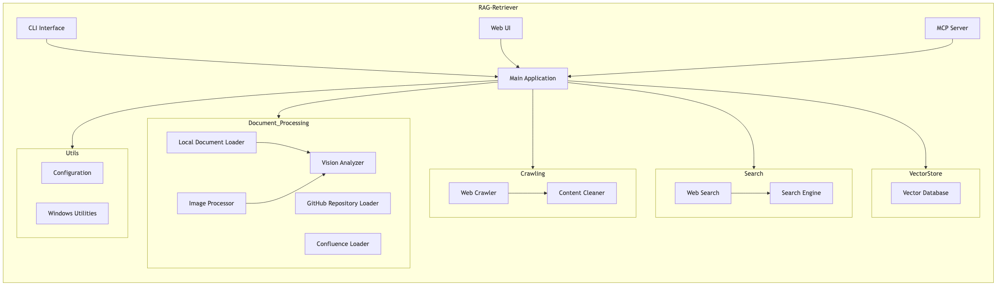
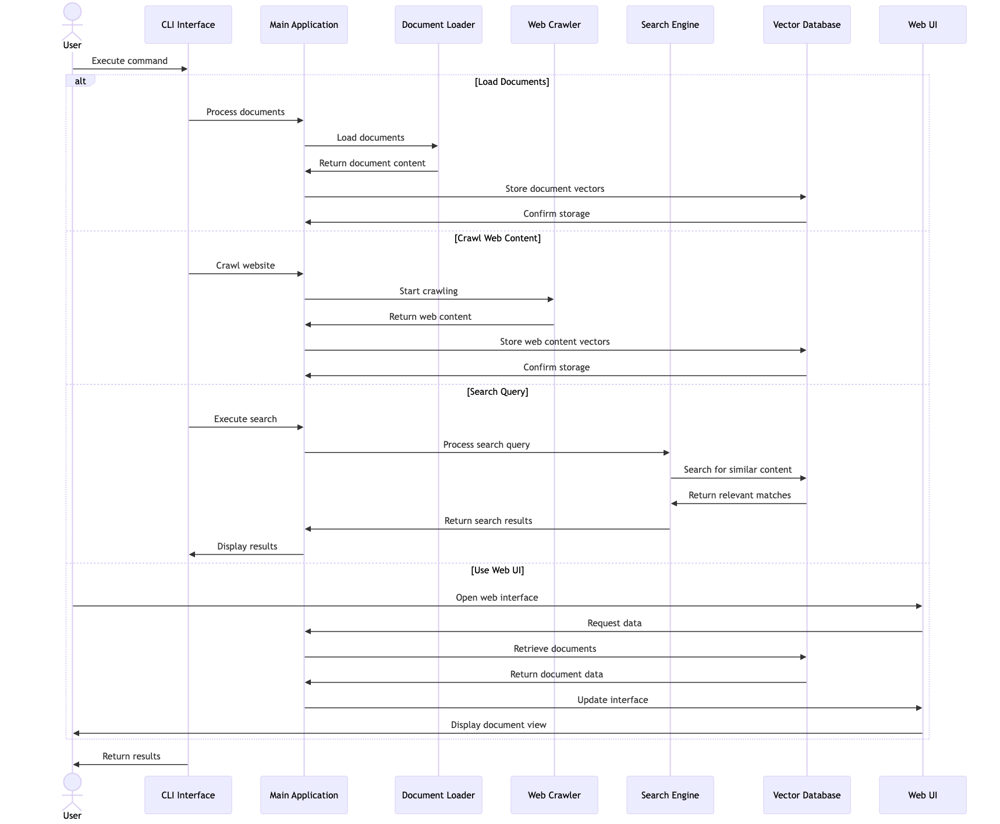
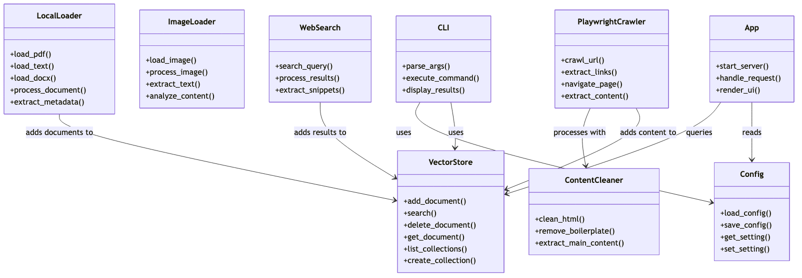

# RAG-Retriever Repository Analysis

## Repository Overview

RAG-Retriever is a Python application designed to implement Retrieval Augmented Generation (RAG) capabilities. It allows users to process, store, and search various document types including PDFs, text files, images, GitHub repositories, and Confluence pages. The system also supports web crawling to extract and process web content.

## Architecture

The repository is organized into several core modules:

### Key Components

1. **Document Processing**
   - Local document loading (PDF, text, docx)
   - Image analysis and text extraction
   - GitHub repository code processing
   - Confluence document integration
   - Vision analysis for enhanced understanding

2. **Web Crawling**
   - Playwright-based web crawler for navigating websites
   - Content cleaning utilities to extract meaningful information

3. **Search Functionality**
   - Web search integration
   - Custom search engine for local content

4. **Vector Storage**
   - Vector database for efficient similarity searches
   - Document storage and retrieval

5. **User Interfaces**
   - Command-line interface for scriptable operations
   - Web UI for interactive usage
   - MCP server for integration with other systems

6. **Utility Functions**
   - Configuration management
   - Windows-specific utilities

## Key Files

Based on the analysis of repository structure and complexity metrics, these are the most important files:

1. **UI and Main Application**
   - `rag_retriever/ui/app.py` - Web interface (highest complexity)
   - `rag_retriever/cli.py` - Command-line interface
   - `rag_retriever/main.py` - Core application logic

2. **Data Storage**
   - `rag_retriever/vectorstore/store.py` - Vector database operations

3. **Document Processing**
   - `rag_retriever/document_processor/local_loader.py` - Handles local files
   - `rag_retriever/document_processor/image_loader.py` - Processes images
   - `rag_retriever/document_processor/github_loader.py` - GitHub integration
   - `rag_retriever/document_processor/vision_analyzer.py` - Visual content analysis

4. **Web Crawling**
   - `rag_retriever/crawling/playwright_crawler.py` - Web crawling
   - `rag_retriever/crawling/content_cleaner.py` - HTML processing

5. **Search**
   - `rag_retriever/search/web_search.py` - Integration with web search engines
   - `rag_retriever/search/searcher.py` - Search engine implementation

## Component Relationships

The application follows a modular architecture with clear separation of concerns:

- The main module coordinates between document processing, crawling, search, and storage
- Document processors convert various content types into formats suitable for vector embedding
- Web crawling retrieves and cleans web content for processing
- The vector store serves as the central repository for all processed content
- Search functionality enables retrieval of relevant information
- User interfaces (CLI and Web UI) provide different ways to interact with the system

## Diagrams

### Component Diagram

### Sequence Diagram

### Class Diagram

## Testing Architecture

The repository includes:

- Unit tests covering individual components
- Integration tests for verifying cross-component functionality
- Testing utilities for validation and regression testing

## Development Focus Areas

Based on code complexity and interdependencies:

1. The web UI has the highest complexity and would benefit from modularization
2. The vector store implementation is a critical component with many dependencies
3. Document processing is well-modularized by content type
4. Test coverage appears comprehensive with dedicated test files for core components

## Conclusion

RAG-Retriever is a feature-rich application for implementing Retrieval Augmented Generation patterns. Its modular architecture enables processing various document types, storing them in a vector database, and retrieving relevant information through search queries. The system supports both programmatic and interactive usage through its CLI and web interface.